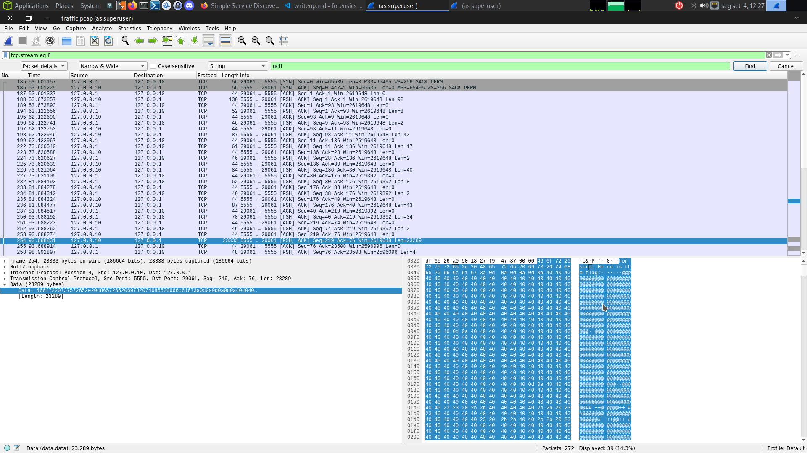
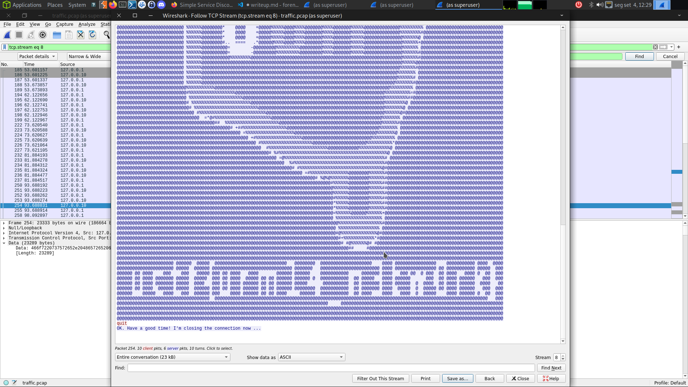

# Tags
- Network Analysis

# Intro

Some cyberpunk hide the flag inside a network traffic. We have dumped the traffic. Your task is to find the flag to save the city.

# Solution

After finding a tcp stream with the data: "Here is the flag"
I followed the tcp stream and got the flag:

Here is the flag:

uctf{urm14_n3tw0rk}