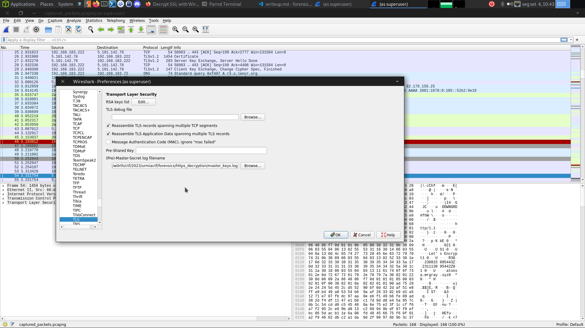
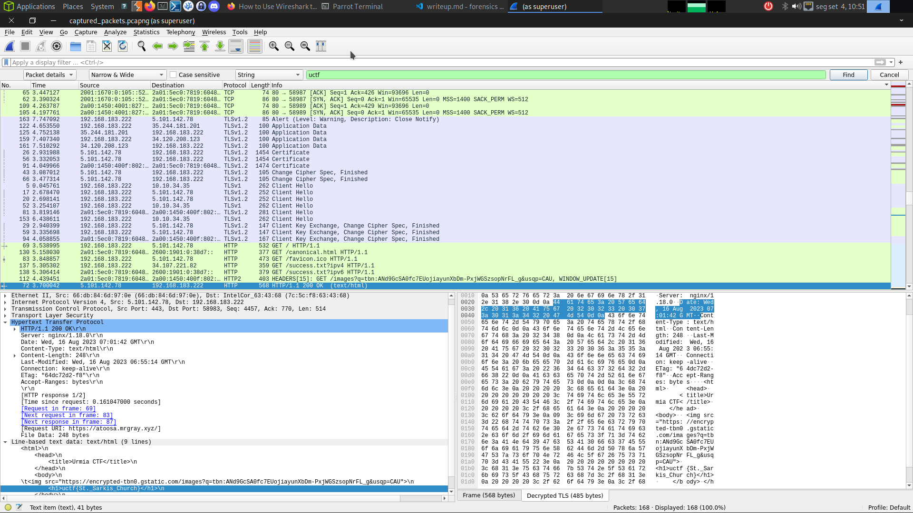

# Tags
- Packet Decryption
- Network Analysis

# Intro

In this challenge, you are provided with a file containing captured network packets and a file containing master keys. Your task is to decrypt the HTTPS traffic and find the flag hidden within the decrypted data. The target domain for this challenge is mrgray.xyz. Good luck!

# Solution

TO be able to find the flag, we need to decrypt the traffic. To do that we need to head to wireshark preferences and add the keys in the TLS config.

Then we filter for the string uctf which is the initial part of the flag.

`<h1>uctf{St._Sarkis_Church}</h1>`