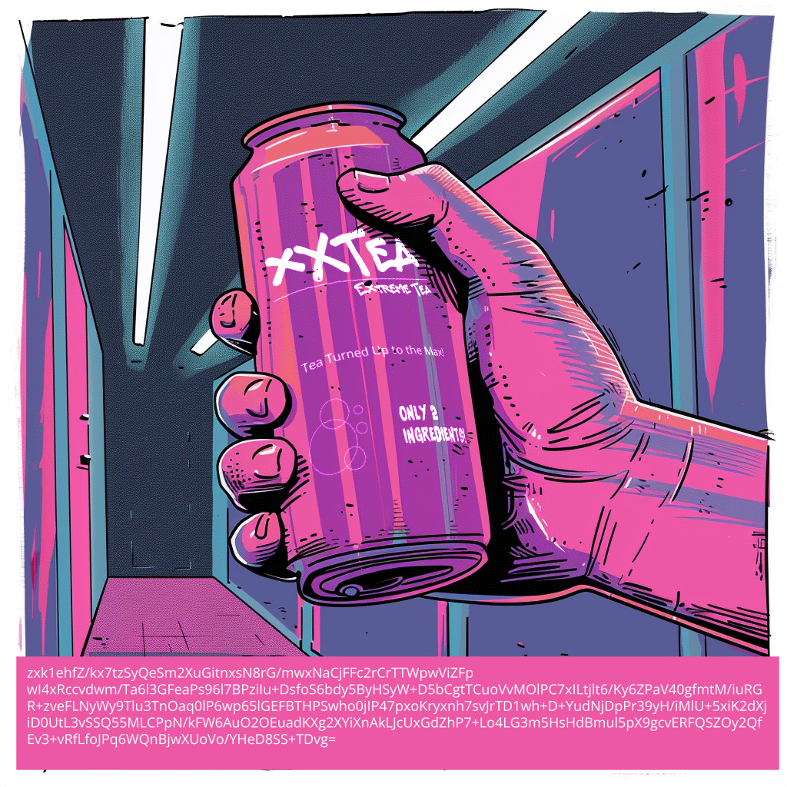

## Logical Left and Rational Right

Created By: Shamel
DEADFACE left this artifact with one of their victims. Can you decipher what it says?

Submit the flag as flag{flag-text}

We are given the following:
```
\/\\/\/\ \///\/\/ \///\\// \///\/\\ \\/\\\\\ \//\\\\/ \\/\\\\\ \//\//\\ \//\/\\/ \///\/\\ \///\/\\ \//\//\\ \//\\/\/ \\/\\\\\ \///\\// \//\//// \//\//\/ \//\\/\/ \///\/\\ \//\/\\\ \//\/\\/ \//\///\ \//\\/// \\/\\\\\ \///\/\\ \//\//// \\/\\\\\ \//\\/// \//\\/\/ \///\/\\ \\/\\\\\ \///\\// \///\/\\ \//\\\\/ \///\\/\ \///\/\\ \//\\/\/ \//\\/\\ \\/\//\\ \\/\\\\\ \//\/\\\ \//\//// \///\\\\ \//\\/\/ \\/\\\\\ \////\\/ \//\//// \///\/\/ \\/\\\\\ \//\/\\\ \//\\\\/ \///\//\ \//\\/\/ \\/\\\\\ \//\\//\ \///\/\/ \//\///\ \\/\\\\\ \///\/\\ \//\/\\\ \//\/\\/ \///\\// \\/\\\\\ \////\\/ \//\\/\/ \//\\\\/ \///\\/\ \\/\\\\\ \/\/\/\\ \///\/\/ \///\\/\ \//\\\/\ \//\//// \\/\\\\\ \/\/\/\\ \//\\\\/ \//\\\// \//\/\// \////\\/ \\/\\\\/ \\/\\\\/ \\/\\\\/ \\/\\\\/ \\/\\\\\ \//\\//\ \//\//\\ \//\\\\/ \//\\/// \////\// \/\\/\\\ \\//\\// \/\//\\/ \/\//\\/ \\//\\\\ \/\/\/\/ \///\\/\ \/\\\//\ \\//\\\/ \/\\///\ \\//\/\\ \\//\\\/ \\//\\\/ \/\//\\/ \\//\/\\ \/\/\/// \\//\/\\ \/\\/\// \\//\\// \/////\/
```

Since it only has the symbol / abd \ and they are divided in 8 each i thought in binary! I made a script to decrypt it:

```python
input = r"\/\\/\/\ \///\/\/ \///\\// \///\/\\ \\/\\\\\ \//\\\\/ \\/\\\\\ \//\//\\ \//\/\\/ \///\/\\ \///\/\\ \//\//\\ \//\\/\/ \\/\\\\\ \///\\// \//\//// \//\//\/ \//\\/\/ \///\/\\ \//\/\\\ \//\/\\/ \//\///\ \//\\/// \\/\\\\\ \///\/\\ \//\//// \\/\\\\\ \//\\/// \//\\/\/ \///\/\\ \\/\\\\\ \///\\// \///\/\\ \//\\\\/ \///\\/\ \///\/\\ \//\\/\/ \//\\/\\ \\/\//\\ \\/\\\\\ \//\/\\\ \//\//// \///\\\\ \//\\/\/ \\/\\\\\ \////\\/ \//\//// \///\/\/ \\/\\\\\ \//\/\\\ \//\\\\/ \///\//\ \//\\/\/ \\/\\\\\ \//\\//\ \///\/\/ \//\///\ \\/\\\\\ \///\/\\ \//\/\\\ \//\/\\/ \///\\// \\/\\\\\ \////\\/ \//\\/\/ \//\\\\/ \///\\/\ \\/\\\\\ \/\/\/\\ \///\/\/ \///\\/\ \//\\\/\ \//\//// \\/\\\\\ \/\/\/\\ \//\\\\/ \//\\\// \//\/\// \////\\/ \\/\\\\/ \\/\\\\/ \\/\\\\/ \\/\\\\/ \\/\\\\\ \//\\//\ \//\//\\ \//\\\\/ \//\\/// \////\// \/\\/\\\ \\//\\// \/\//\\/ \/\//\\/ \\//\\\\ \/\/\/\/ \///\\/\ \/\\\//\ \\//\\\/ \/\\///\ \\//\/\\ \\//\\\/ \\//\\\/ \/\//\\/ \\//\/\\ \/\/\/// \\//\/\\ \/\\/\// \\//\\// \/////\/"

x = input.split(" ")

for i in x:
    processed_string = i.replace('\\', '0').replace('/', '1')

    # Convert binary string to ASCII
    ascii_string = ''.join([chr(int(processed_string[j:j+8], 2)) for j in range(0, len(processed_string), 8)])
    
    print(ascii_string, end="")

```

Flag: `Just a little something to get started, hope you have fun this year Turbo Tacky!!!! flag{H3YY0UrF1N411Y4W4K3}`

## Social Pressure

Created by: syyntax
We intercepted this chat log between luciafer and lilith. We believe they’re discussing who or what they will target for their social engineering campaign.

Decode the message and submit the name of the target. The key is to remember that sometimes the simplest solutions are just waiting to be reflected upon.

Submit the flag as flag{First_Last}.


Message:

```
luciafer 1:19 PM
Svb ororgs, yrt mvdh! Dv'iv tlrmt zugvi Wv Nlmmv Urmzmxrzo mvcg. Gsvri hvxfirgb nvzhfivh szev hlnv slovh gszg dv'iv tlmmz vckolrg yrt grnv! R'ev yvvm klprmt zilfmw zmw ulfmw hlnv HJO efomvizyrorgrvh dv xzm oveviztv uli nzcrnfn xszlh.

Ivnvnyvi gszg RG tfb R nvmgrlmvw yvuliv? Gfimh lfg, sv’h z ivzo xszggb Xzgsb lm hlxrzo nvwrz. Gsrmp dv xzm fhv hlnv tllw lo' hlxrzo vmtrmvvirmt gl lfi zwezmgztv. Dv’oo tvg srn hkvdrmt kzhhdliwh orpv z ovzpb uzfxvg. Kofh, drgs blfi LHRMG hprooh zmw nb HJO nztrx, gsvb dlm’g hvv dszg srg 'vn.

lilith 1:20 PM
R'ev zoivzwb hgzigvw hlnv LHRMG ivxlm zmw tfvhh dszg? Ulfmw hlnv qfrxb wvvgh zylfg gsvri RG gvzn lm OrmpvwRm. Kvlkov levihsziv hl nfxs, rg'h kizxgrxzoob z tlownrmv. Hlxrzo vmtrmvvirmt gszg xszggb wfwv hslfow yv z yivvav; R'oo xizug z ovtvmw gszg'oo szev srn hkroormt vevibgsrmt.

luciafer 1:21 PM
Bzzzh, gsrh rh tlmmz yv ovtvmwzib! Olermt gsv vmgsfhrzhn. Zmw Voilb Lmtzil? Gszg tfb'h kizxgrxzoob iloormt lfg gsv ivw xzikvg uli fh drgs sld nfxs sv hszivh lmormv. Xzm'g yvorvev sld vzhb hlnv lu gsvhv gzitvgh nzpv rg.

lilith 1:22 PM
Zyhlofgvob! Voilb Lmtzil szh ml rwvz dszg'h xlnrmt srh dzb. R'ev zoivzwb tlg z uvd zmtovh rm nrmw gl tvg srn gzoprmt. Hlxrzo vmtrmvvirmt gsvhv gbkvh rh zodzbh z gsiroo.

R'oo hgzig wizugrmt hlnv kvihlmzh zmw hxirkgh. Lmxv sv'h fmwvi lfi rmuofvmxv, dv xzm lixsvhgizgv gsv HJO vckolrg hvznovhhob. Blfi vckvigrhv rm gszg zivz rh tlrmt gl yv xifxrzo.

```

Identify the cipher with: https://www.dcode.fr/cipher-identifier

and then use: https://www.dcode.fr/chiffre-atbash 

Message:

```
ofxrzuvi 1:19 KN
Hey lilith, big news! We're going after De Monne Financial next. Their security measures have some holes that we're gonna exploit big time! I've been poking around and found some SQL vulnerabilities we can leverage for maximum chaos.

Remember that IT guy I mentioned before? Turns out, he’s a real chatty Cathy on social media. Think we can use some good ol' social engineering to our advantage. We’ll get him spewing passwords like a leaky faucet. Plus, with your OSINT skills and my SQL magic, they won’t see what hit 'em.

ororgs 1:20 KN
I've already started some OSINT recon and guess what? Found some juicy deets about their IT team on LinkedIn. People overshare so much, it's practically a goldmine. Social engineering that chatty dude should be a breeze; I'll craft a legend that'll have him spilling everything.

ofxrzuvi 1:21 KN
Yaaas, this is gonna be legendary! Loving the enthusiasm. And Elroy Ongaro? That guy's practically rolling out the red carpet for us with how much he shares online. Can't believe how easy some of these targets make it.

ororgs 1:22 KN
Absolutely! Elroy Ongaro has no idea what's coming his way. I've already got a few angles in mind to get him talking. Social engineering these types is always a thrill.

I'll start drafting some personas and scripts. Once he's under our influence, we can orchestrate the SQL exploit seamlessly. Your expertise in that area is going to be crucial.
``` 

Flag: `flag{Elroy_Ongaro}`

## Discrete Logging

Created By: neatzsche
DEADFACE is running a server that is used to crack encryption of some sort. They didn’t secure their log server, so we have their logs. Please find out what key they cracked.

Submit the flag as flag{...}.

We have a log like:

```
computing discrete log for prime: 191
discrete log found: 25
computing discrete log for prime: 1621
discrete log found: 293
computing discrete log for prime: 61
discrete log found: 49
computing discrete log for prime: 2447
discrete log found: 2105
computing discrete log for prime: 991
discrete log found: 564
computing discrete log for prime: 1297
discrete log found: 50
computing discrete log for prime: 47
discrete log found: 13
computing discrete log for prime: 1049
discrete log found: 21
computing discrete log for prime: 347
discrete log found: 229
computing discrete log for prime: 283
discrete log found: 257
```

It seems like discrete logging where we need to solve the following equation: $`g^x = h \ (mod \ p)`$ knowing $`(x, p)`$ and I thought flag char was the $`h`$ value, but actually it was just CRT (Chinese Remainder Theorem) which allow us to solve congruence system see details [here](https://en.wikipedia.org/wiki/Chinese_remainder_theorem).

Script to get the primes and logs:

```python
import requests

url = "https://cyberhacktics.sfo2.digitaloceanspaces.com/DEADFACECTF2024/challenges/crypto/crypto13/ecdh_crack_20241013.log"
PRIMES = []
LOGS = []
resp = requests.get(url)
data = resp.text

for line in data.split('\n'):
    if 'computing' in line:
        PRIMES.append(int(line.replace('computing discrete log for prime: ', '')))
    else:
        LOGS.append(int(line.replace('discrete log found: ', '')))
print(PRIMES)
print(LOGS)
```

With the values we use CRT function:

```python
from Crypto.Util.number import long_to_bytes
nis = [191, 1621, 61, 2447, 991, 1297, 47, 1049, 347, 283, 2617, 1429, 167, 307, 431, 683, 1627, 17, 827, 97, 523, 151, 37, 2269, 1733, 3, 19, 439]
cis = [25, 293, 49, 2105, 564, 50, 13, 21, 229, 257, 307, 511, 124, 7, 63, 476, 1054, 2, 793, 60, 270, 145, 32, 796, 1041, 1, 9, 60]
print(long_to_bytes(crt(cis, nis)) 
```

Note: crt function is created by us but can be easily grabbed from the net!

Flag: `flag{ch1n3s3-r3mAind3r-D-l0g}`


## Drink up!

Created by: syyntax
While responding to a recent security incident, TGRI found the following image on an employee’s compromised machine. We need to confirm which DEADFACE actor attacked TGRI.

There’s probably one or more hints in the image that will point you in the right direction.

Submit the flag as flag{flag}.

We are given the following mage and cipher:



```
zxk1ehfZ/kx7tzSyQeSm2XuGitnxsN8rG/mwxNaCjFFc2rCrTTWpwViZFpwI4xRccvdwm/Ta6l3GFeaPs96l7BPziIu+DsfoS6bdy5ByHSyW+D5bCgtTCuoVvMOlPC7xILtjlt6/Ky6ZPaV40gfmtM/iuRGR+zveFLNyWy9Tlu3TnOaq0lP6wp65lGEFBTHPSwho0jIP47pxoKryxnh7svJrTD1wh+D+YudNjDpPr39yH/iMlU+5xiK2dXjiD0UtL3vSSQ55MLCPpN/kFW6AuO2OEuadKXg2XYiXnAkLJcUxGdZhP7+Lo4LG3m5HsHdBmul5pX9gcvERFQSZOy2QfEv3+vRfLfoJPq6WQnBjwXUoVo/YHeD8SS+TDvg=
```

We can identify already the cipher used which is xxtea. 
In cryptography, Corrected Block TEA (often referred to as XXTEA) is a block cipher designed to correct weaknesses in the original Block TEA. 

However we dont know the key but we have some keywords in the can.
Lets build a script to decode and then we can try some phrases from the can. For that we will use a python lib called xxpea-py: https://github.com/xxtea/xxtea-python 

```python
# pip install xxtea-py

import xxtea
import base64
text = "zxk1ehfZ/kx7tzSyQeSm2XuGitnxsN8rG/mwxNaCjFFc2rCrTTWpwViZFpwI4xRccvdwm/Ta6l3GFeaPs96l7BPziIu+DsfoS6bdy5ByHSyW+D5bCgtTCuoVvMOlPC7xILtjlt6/Ky6ZPaV40gfmtM/iuRGR+zveFLNyWy9Tlu3TnOaq0lP6wp65lGEFBTHPSwho0jIP47pxoKryxnh7svJrTD1wh+D+YudNjDpPr39yH/iMlU+5xiK2dXjiD0UtL3vSSQ55MLCPpN/kFW6AuO2OEuadKXg2XYiXnAkLJcUxGdZhP7+Lo4LG3m5HsHdBmul5pX9gcvERFQSZOy2QfEv3+vRfLfoJPq6WQnBjwXUoVo/YHeD8SS+TDvg="
key = "Tea Turned Up to the Max!"
decrypt_data = xxtea.decrypt_utf8(base64.b64decode(text), key)
print(decrypt_data);
```

The key was `Tea Turned Up to the Max!`. The message is:

```
Ah, I see you've stumbled upon my little souvenir. By now, you must be feeling pretty exposed. It's a shame companies like yours invest in everything but proper security. Remember, this isn't personal; it's just your turn. Sleep tight, spookyboi was here. flag{br3wed_4_the_B0ld!}
```

## Sleeping (Marble) Beauty

Created By: The Zeal0t
Sleeping Marble Beauty

Phantastes, by George MacDonald

(Decode TheZeal0t’s personal recommendation / Words of Wisdom for how you should normally proceed in this situation…)

Submit the flag as flag{flag-text}

We are given the following text with the name marble-lady-CN.txt:

Executing the following:

`strings -eb marble-lady-CN.txt`

We get:

```
"Marble woman, vainly sleeping
In the very death of dreams!
Wilt thou -- slumber from the sweeping
All but what with vision teams --
Hear my voice come through the golden
Mist of memory and hope;
And with shadowy smile embolden
Me with primal Death to cope?
"Thee the sculptors all pursuing,
Have embodied but their own;
Round their visions, form enduring;
Marble vestments thou hast thrown;
But thyself, in silence winding,
Thee they found not, many finding --
I have found thee; wake for me."
"Rest is now filled full of beauty,
And can give thee up, I ween;
Come thou forth, for other duty
Motion pineth for her queen.
"Or, if needing years to wake thee
From thy slumbrous solitudes,
Come, sleep-walking, and betake thee
To the friendly, sleeping woods.
Sweeter dreams are in the forest,
Round thee storms would never rave;
And when need of rest is sorest,
Glide thou then into thy cave.
"Or, if still thou choosest rather
Marble, be its spell on me;
Let thy slumber round me gather,
Let another dream with thee!"
"Oh are thou Death, O woman? for since I
Have set me singing by thy side,
Life hath forsook the upper sky,
And all the outer world hath died.
"Yea, I am dead; for thou hast drawn
My life all downward unto thee.
Dead moon of love! let twilight dawn:
Awake! and let the darkness flee.
"Cold lady of the the lovely stone!
Awake! or I shall perish here;
And thou be never more alone,
My form and I for ages near.
"But words are vain; reject them all --
They utter but a feeble part:
Hear thou the depths from which they call,
The voiceless longing of my heart."
"Not a sound
But, echoing in me,
Vibrates all around
With a blind delight,
Till it breaks on Thee,
Queen of Night!
Every tree,
O'ershadowing with gloom,
Seems to cover thee
Secret, dark, love-still'd,
In a holy room
Silence-filled.
"Let no moon 
Creep up the heaven to-night;
I in darksome noon
Walking hopefully,
Seek my shrouded light--
Grope for thee!
"Darker grow
The border of the dark!
Through the branches glow,
From the roof above,
Stars and diamond-sparks
Light for love."
George MacDonald, Phantastes
(.#)=u*M1*MMMy17M5*17.&M*#8'M.'6M*'4MsleepMbroAMZo?
```

Put the final line in cyberchef and make a rot of 62: `(.#)=u*M1*MMMy17M5*17.&M*#8'M.'6M*'4MsleepMbroAMZo?` 

Flag: `flag{Uh-oh---You-should-have-let-her-SLEEP-BRO!-:O}`