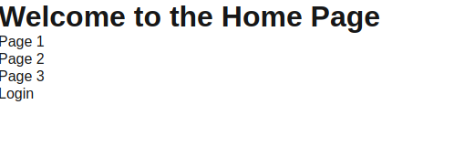
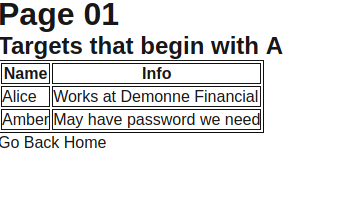
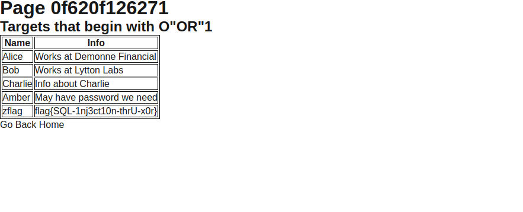

## Target List 1

Created By: neatzsche
Deadface is running a server where they have a list of targets they are planning on using in an upcoming attack. See if you can find any targets they are trying to hide.

http://targetlist.deadface.io:3001

Submit the flag as flag{flag-text}

We have a webpage that has a navbar with a few pages and a login page:

If we open the page we have: http://targetlist.deadface.io:3001/pages?page=1

It seems like it takes the input from the get request page and makes a sql query. If we access the page number: f620f126271, we perform a sql injection and are able to get the flag:

Note: The intended way of doing the challenge was to get the xor value from the xor of the input and the value that is showed in the "targets that begin with *****"

Flag: `flag{SQL-1nj3ct10n-thrU-x0r}`

## Target List 2

Created By: neatzsche
Deadface has an admin panel on their target list site. See if you can log into it as admin..

http://targetlist.deadface.io:3001/admin

Submit the flag as flag{flag-text}

This next challenge focus on the login page.
We can reuse the sql injection we found to get more data.

`select * from user where name like "PAGE%" union select password,"1"`