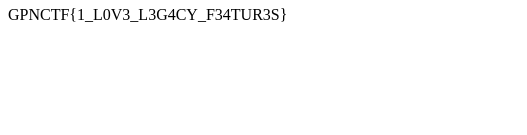

I removed the flag :P


We are presented with two forms, one to request to /chal with two parameters flag and html.
The second form performs POST to /admin with one parameter html.

/chal endpoint is called and it generates the following template:

```html
<head>
    <script async defer src="/removeFlag.js"></script>
</head>
<body>
    <div class="flag">${flag}</div>
    ${html}
</body>
```

It will then remove the flag div with the script removeFlag.js:

```js
let els = document.body.querySelectorAll('.flag');
    if (els.length !== 1) throw "nope";
    els[0].remove();
} catch(e) { location = 'https://duckduckgo.com/?q=no+cheating+allowed&iax=images&ia=images' }
```

The admin endpoint accepts a html and makes a request to chal endpoint with the actual flag and our html.

In order to stop the script from deleting the flag we can use dom clobbering. Dom clobbering is basically creating another reference of a DOM object in order to change the behavior of javascript on the page.

Here they give an example of using a form tag: <https://portswigger.net/web-security/dom-based/dom-clobbering>

In our case we just need to create a body id that contains a some tag with the id flag:

`<form name="body<body>"><div class=flag></form>`

So document.body.querySelectorAll('.flag') returns only our div since it refers to the form name "body".

Examples of DOM clobbering: https://book.hacktricks.xyz/pentesting-web/xss-cross-site-scripting/dom-clobbering#clobbering-document-object

