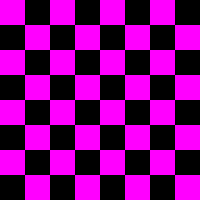
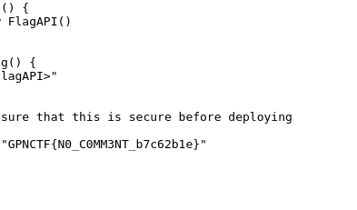

I made a JS API! Sadly I had no time to finish it :(

There are two main endpoints:

- `/chal`: chal accepts a html and renders it in the page in addition to the script.js. However if we dont have the random bytes generate initially we don't get the flag.

- `/admin`: admin accepts a html too and calls the chal endpoint using pupeteer. Once it renders the page with the html submited it takes a screenshot. Since the bot has the random bytes it shows the flag if it browses to script.js. 

In order to make the bot browse to the page and take a screenshot we can use Inline execution of JS.

Simple exploit 

This will send the bot to the script.js and it takes a screenshot of the script.js with the flag.

