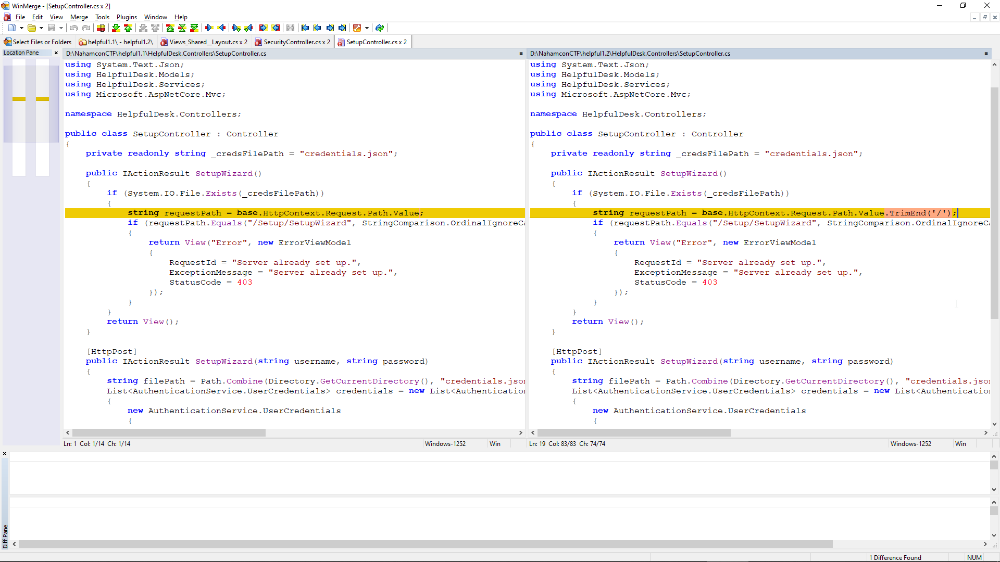

## Title

HelpfulDesk

## Description

Author: @HuskyHacks

HelpfulDesk is the go-to solution for small and medium businesses who need remote monitoring and management. Last night, HelpfulDesk released a security bulletin urging everyone to patch to the latest patch level. They were scarce on the details, but I bet that can't be good...

## Solution

Download the helpfuldesk zip version 1.1 and 1.2.
Compare them: 

```shell
diff -rq helpfuldesk-1.1 helpfuldesk-1.2

Files helpfuldesk-1.1/HelpfulDesk.dll and helpfuldesk-1.2/HelpfulDesk.dll differ
Files helpfuldesk-1.1/HelpfulDesk.pdb and helpfuldesk-1.2/HelpfulDesk.pdb differ
```

We need to decompile both dll files to see what function is vulnerable to RCE that they patch.
However I dont know any linux decompiler.

Opening both zips into a decompiler we see a change in the file :



Browsing to /Setup/SetupWizard/ we get the admin login and it has default creds admin/admin.
Once we get to the admin dashboard just go to: HOST-WIN-DX130S2 and the flag.txt is on the desktop.