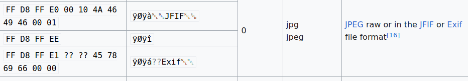
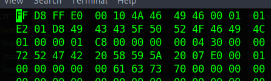
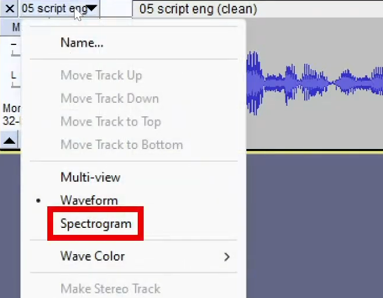
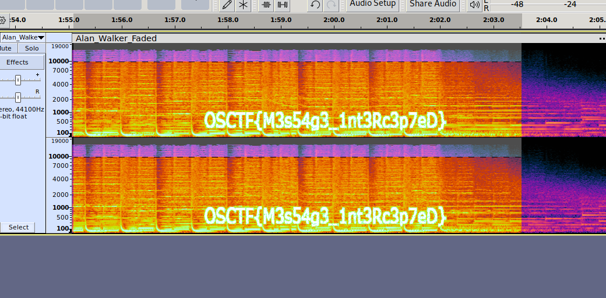
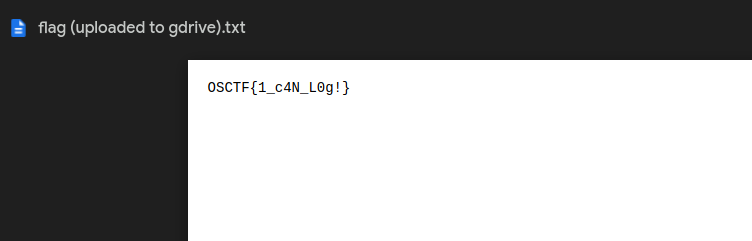

## The Lost Image Mystery

In the bustling city of Cyberville, a crucial image file has been corrupted, and it's up to you, a budding digital forensics expert, to recover it. The file appears to be damaged, can you recover the contents of the file?

Author: @5h1kh4r

If we do strings in the image we get an interesting string in the beggining called ICC_PROFILE, searching for it we find out that its commonly present in jpeg images. So we change the extension to .jpeg and change the magic bytes: 

To change the magic bytes we used hexedit: `hexedit image.jpeg`

Flag: OSCTF{W0ah_F1l3_h34D3r5}

## The Hidden Soundwave 

We've intercepted some signals which is allegedly transmitted by aliens...? Do aliens listen to Alan Walker? I don't know, it's up to you to understand but we are sure there's something hidden in this song and we need to decrypt it!

Author: @5h1kh4r

Using audacity tool just open the audio file and in the options choose spectogram:

And we got the flag:

Flag: OSCTF{M3s54g3_1nt3Rc3p7eD}

##  Mysterious Website Incident 

In the heart of Cyber City, a renowned e-commerce website has reported suspicious activity on its servers. As a rookie digital investigator, you've been called in to uncover the truth behind this incident. Your journey begins with examining the server's records, searching for clues that could shed light on what transpired.

Author: @5h1kh4r

One of the requests in the logs has a link to a google driver: 

<https://drive.google.com/file/d/15IwD7QiSKtvmW7XG2gYkdnwW0bxXBgdj/view?usp=drive_link>

It gives us the flag:

Flag: OSCTF{1_c4N_L0g!}

Additionally: `awk '{match($0, /"([A-Z]+) (\/[^ ]*)[^"]*"/, arr); if (arr[0] != "") print arr[1], arr[2], $11}' nginx_logs.txt  > method_endpoint_url.txt` this command gives us `method endpoint url`

##  Phantom Script Intrusion 

In the realm of Cyberspace County, a notorious cybercriminal has planted a stealthy PHP malware script on a local server. This malicious script has been cunningly obfuscated to evade detection. As a novice cyber detective, you are called upon to unravel the hidden intentions behind this cryptic code.

Author: @5h1kh4r

basically we have a php that has the variables and the values of the variables encoded as hexadecimal. Once we decode the values we get: `hXXps://sh0rturl.at/s1fW2` this we turn into: `https://shorturl.at/s1fW2` and browsing to that we get the flag:

Flag: OSCTF{M4lW4re_0bfU5CAt3d}